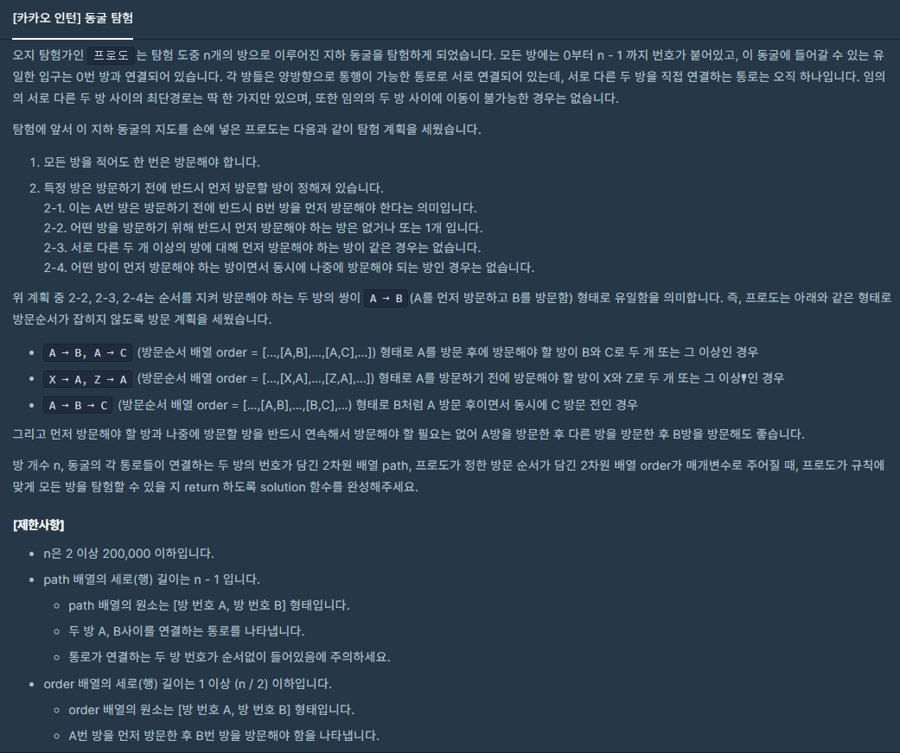
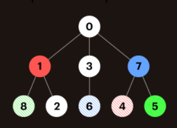
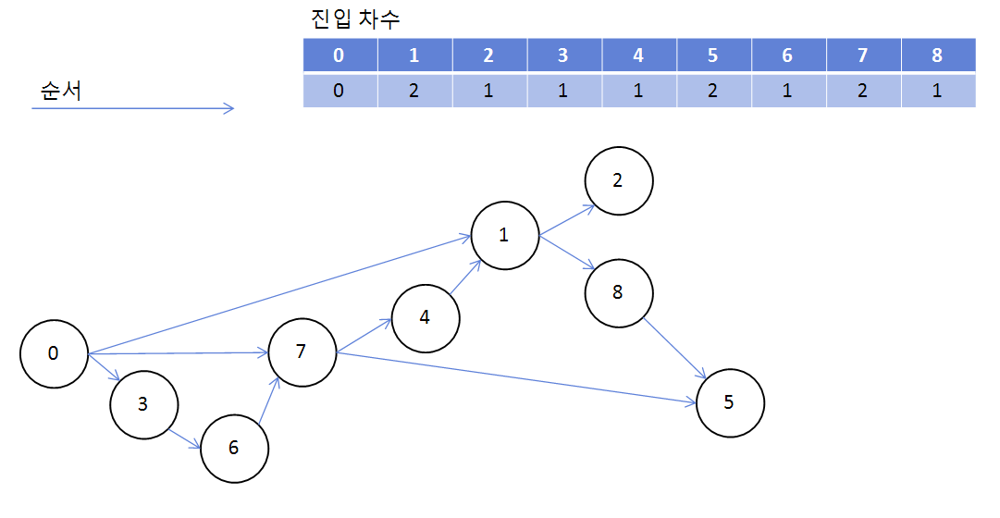

### 동굴 탐험



- On(N)


##### 사용한 알고리즘

- Topology Sort


##### 풀이 로직

- 0에서 부터 인접 노드를 순회하며 방을 움직인다.
- 두 방을 연결하는 통로는 단 하나이고 어떤 노드는 특정 노드를 방문해야 움직일 수 있다.
- Visit을 체크하면서 순회를 하면 순서가 있는 단방향 그래프로 만들 수 있다.
- 특정 노드를 방문해야 하는 노드는 특정 노드 보다 순서가 나중에 와야한다. (위상 정렬)

ex)






##### 조건

1. 왔던 방을 다시 방문 할 수 있다.
2. order에 따라 특정 노드를 방문해야 갈 수 있는 방이 있다.
3. n <= 200000


##### Code

```javascript
function solution(n, path, order) {
    // 방문해야하는 총 노드의 갯수
    var cnt = n-1
    var narr = Array.from({length:n},()=>[])
    // 진입차수 -> 모든 방에 갈 수 있는 방법은 한가지라고 했으므로 1로 채워져있는 배열을 만든다.
    var indegree = Array.from({length:n}, ()=>1) // Array(n).fill(1)
    path.forEach(([a,b])=>{
        narr[a].push(b)
        narr[b].push(a)
    })
    indegree[0] = 0
    // order에서 생기는 우선순위를 진입차수에 추가
    order.forEach(([a,b])=>{
        narr[a].push(b)
        indegree[b] += 1
    })
    // 만약에 시작점이 우선순위에 걸려 출발하지 못할경우 false 리턴
    if (indegree[0]){
        return false
    }
    var q = [0]
    var cur
    // BFS 순회하면서 진입 차수를 낮춘다.
    while (q.length){
        cur = q.shift()
        narr[cur].forEach(nxt=>{
            // 싸이클이 생길경우 진입 차수가 음수가 되기 때문에 조건문을 걸어준다. (여기서 바로 리턴해도 무방하다.)
            if (indegree[nxt] > 0){
                indegree[nxt] -= 1
                // 진입 차수가 0이 되면 출발할 수 있다. (앞순서의 노드들이 모두 진출했다.)
                if (indegree[nxt] == 0){
                    // 해당 방을 방문하였으므로 cnt -= 1
                    cnt -= 1
                    q.push(nxt)
                }
            }
        })
    }
    // 아직 방문하지 못한 방이 있으면 false 리턴, 아니면 true 리턴
    if (cnt>0){
        return false
    } else{
        return true
    }
}
```


##### 다른 방법

- O(N)


##### 사용한 알고리즘

- Breadth First Search


##### 풀이 로직

-  order 배열에서 A 방을 방문해야 B 방에 들어갈 수 있을 때 A와 B를 각각 저장할 수 있는 배열을 만든다.
- ord_ls[B] = A  -> B방에 가려면 A방에 들려야한다.
- rel_ls[A] = B  -> A방에 도착하면 B방에 갈 수 있다.
- 방문체크를 하면서 해당 방을 갈 수 있는 지 확인
- 방문체크에서 걸릴 경우 먼저 가야하는 방이 있는 것이므로 vis 배열에 -1을 기입한다.
- 방문체크를 통과했을 때 해당 방을 통과했을 때 갈 수 있는 방이 있는지 확인한다.
- vis에 0이나 -1이 있는지 확인하고 있다면 False를 반환, 아니면 True를 반환한다. (이 방법으로 풀 때는 cnt를 적용을 안했었다.)


```python
from collections import deque
def solution(n, path, order):
    answer = False
    # 방문했는지 확인하는 배열
    vis = [0]*n
    # 0은 시작점
    vis[0] = 1
    nxt_ls = [[] for i in range(n)]
    # 해당 방번호에 들어가려면 가야하는 방을 넣어준다. (0은 시작하자마자 방문하므로 0으로 초기화)
    ord_ls = [0 for i in range(n)]
    # 해당 방에 방문했을 때 들어갈 수 있는 방을 넣어준다. (값이 있을 경우만 확인 할 것이므로 없다면 0을 넣어준다.)
    rel_ls = [0 for i in range(n)]
    for a,b in path:
        nxt_ls[a].append(b)
        nxt_ls[b].append(a)
    for a,b in order:
        ord_ls[b] = a
        rel_ls[a] = b
    q = deque([0])
    # BFS를 돌면서 방문 시작.
    while q:
        node = q.popleft()
        # node를 방문하려면 미리 방문했어야 하는 방의 vis 체크
        if vis[ord_ls[node]]:
            vis[node] = 1
            for i in nxt_ls[node]:
                if vis[i] == 0:
                    q.append(i)
            # 해당 노드를 방문했을 때 열리는 방이 있는지 확인한다.
            mod = rel_ls[node]
            # rel_ls에 방이 들어있지 않으면 mod = 0 이므로 False
            # 열리는 방이 있더라도 아직 방문하지 않았다면 False (나중에 돌때 vis부분에서 확인)
            if mod and vis[mod] == -1:
                q.append(mod)
        # node를 아직 방문할 수 없으면 vis[node] = -1 체크를 하고 이후 mod에서 확인
        else:
            vis[node] = -1
    if vis.count(0) + vis.count(-1):
        answer = False
    else:
        answer = True
    
    return answer

n, path, order = 	9, [[0, 1], [0, 3], [0, 7], [8, 1], [3, 6], [1, 2], [4, 7], [7, 5]], [[8, 5], [6, 7], [4, 1]]

print(solution(n,path,order))
```


##### 어려웠던 점

- 