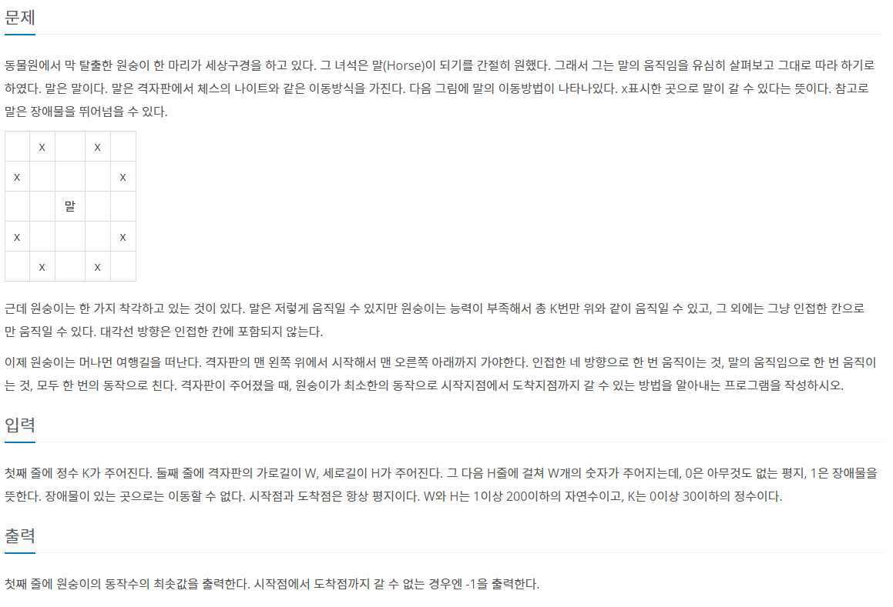
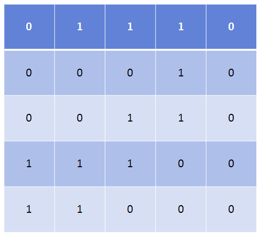

### 말이 되고픈 원숭이



- On(K*N**2)


##### 사용한 알고리즘

- Breadth First Search


##### 풀이 로직

- 최소한의 동작으로 도착지점까지 갈 수 있는 방법을 찾는 것이기 때문에 BFS를 사용하였다.

- 한번의 동작을 묶기 위해 while문 밑에 현재 q의 갯수만큼 for문을 돌려주었다.

- 2차원 배열로 해결이 가능한가?

  ex)

  

- k값에 관해서도 visit을 추가해 3차원 visit을 사용한다.

  


##### 조건

1. k번 만큼 knight 처럼 움직일 수 있다.
2. w,h <= 200, k <= 30이다


##### Code

```python
from collections import deque
dx = [-1,0,1,0]
dy = [0,1,0,-1]
# 말이 움직이는 방향
hx = [-2,-1,1,2,2,1,-1,-2]
hy = [1,2,2,1,-1,-2,-2,-1]
K = int(input())
w,h = map(int,input().split())
arr = [list(map(int,input().split())) for i in range(h)]
q = deque([[0,0,0]])  # 각각 k,h,w
# visit을 3차원으로 만들어준다. vis[k][h][w]
vis = [[[0]*w for _ in range(h)] for _ in range(K+1)]
vis[0][0][0] = 1
# 시작점과 도착점이 같은경우
if w == 1 and h == 1:
    print(0)
    exit()
ans = 0
while q:
    ans += 1
    for _ in range(len(q)):
        jump, x, y = q.popleft()
        # 그냥 걸어서 가는 경우
        for p in range(4):
            xi = x+dx[p]
            yi = y+dy[p]
            if 0<=xi<h and 0<=yi<w and arr[xi][yi] == 0 and vis[jump][xi][yi] == 0:
                if xi == h-1 and yi == w-1:
                    print(ans)
                    exit()
                vis[jump][xi][yi] = 1
                q.append([jump,xi,yi])
        # 말처럼 가는경우
        if jump < K:
            jump += 1
            for p in range(8):
                xi = x+hx[p]
                yi = y+hy[p]
                if 0<=xi<h and 0<=yi<w and arr[xi][yi] == 0 and vis[jump][xi][yi] == 0:
                    if xi == h-1 and yi == w-1:
                        print(ans)
                        exit()
                    vis[jump][xi][yi] = 1
                    q.append([jump,xi,yi])
print(-1)


```


##### 어려웠던 점

- 