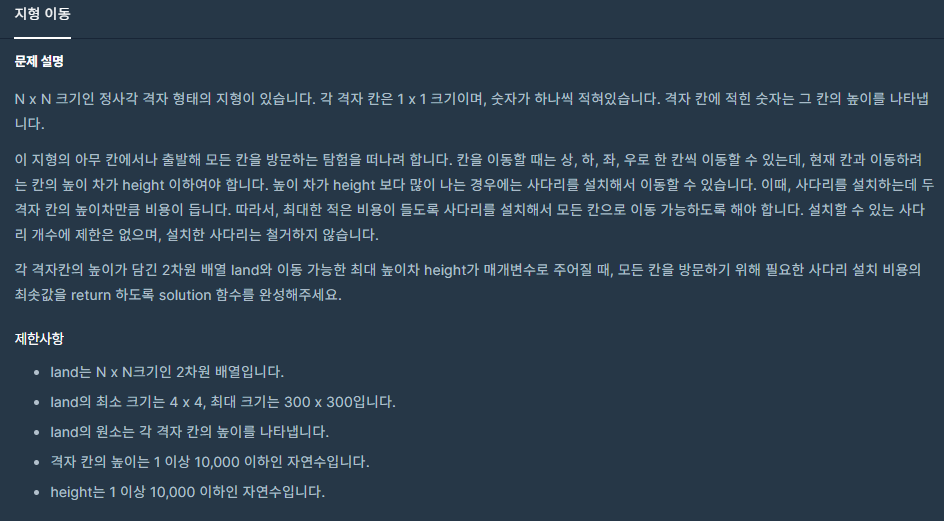
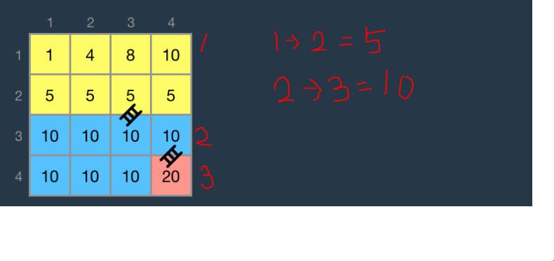

### 지형 이동



- On(N**2)


##### 사용한 알고리즘

- Breadth First Search
- Union Find


##### 풀이 로직

- BFS 를 돌면서 클러스터링을 한다. (height 이하인 노드들을 묶어준다)

- for문을 두번 돌면서 클러스터링 되있는 집단들 간의 최소거리를 갱신시켜준다.

- 위에서 갱신할 때 Dictionary 를 통해 ht\[x][y] = a 형태로 만들어준다. (x집단에서 y집단까지의 최소거리)

  ex)

  

- 모아놓은 최소거리들을 정렬한 후 (값이 작은 것부터 합쳐야 최소값이 나온다.) 앞에서부터 Union 작업을 실행한다.


##### 조건

1. height <= 10000
2. n <= 300


##### Code

```javascript
// Union Find에서 Find 부분
function find(x,parent){
    if (parent[x] == x) return x
    parent[x] = find(parent[x], parent)
    return parent[x]
}

// Union Find에서 Union 부분
function merge(parent,ladder){
    var ans = 0
    var v,x,y,px,py
    ladder.forEach((iter)=>{
        [v,x,y] = iter
        px = find(x,parent)
        py = find(y,parent)
        if (px != py){
            parent[py] = px
            ans += v
        }
    })
    
    return ans
}

function solution(land, height) {
    var n = land.length
    var marking = Array(n).fill(0)
    for (var i=0; i<n; i++){
        marking[i] = Array(n).fill(0)
    }
    var dx,dy,q,ht,cnt,cur,x,y,xi,yi
    ht = new Map()
    dx = [-1,0,1,0]
    dy = [0,1,0,-1]
    cnt = 0
    // 클러스터링 진행
    for (var i=0; i<n; i++){
        for (var j=0; j<n; j++){
            // 클러스터링 되지 않았다면
            if (marking[i][j] == 0){
                cnt += 1
                q = [[i,j]]
                marking[i][j] = cnt
                // 집단 수를 늘려주고 BFS를 이용해 클러스터링
                while (q.length){
                    cur = q.shift()
                    x = cur[0]; y = cur[1];
                    for (var p=0; p<4; p++){
                        xi = x+dx[p]; yi = y+dy[p];
                        if (xi>=0 && xi<n && yi>=0 && yi<n){
                            if (marking[xi][yi] == 0){
                                if (Math.abs(land[xi][yi] - land[x][y]) <= height){
                                    q.push([xi,yi])
                                    marking[xi][yi] = cnt
                                }
                            }
                        }
                    }
                }
            }
        }
    }
    var a,b,dh
    // 클러스터링이 끝나면 각각의 집단에서 다른 집단으로 넘어갈 때 최솟값 갱신
    for (var x=0; x<n; x++){
        for (var y=0; y<n; y++){
            for (var k=0; k<4; k++){
                xi = x+dx[k]; yi = y+dy[k];
                if (xi<n && xi>=0 && yi<n && yi>= 0 && marking[xi][yi] != marking[x][y]){
                    a = marking[xi][yi]
                    b = marking[x][y]
                    dh = Math.abs(land[xi][yi] - land[x][y])
                    // 클러스터링을 할 때 중복이 생기는걸 방지하기 위해 a < b 형태로 맞춰준다.
                    if (a>b){
                        [a,b] = [b,a]
                    }
                    // 갱신
                    if (a in ht){
                        if (b in ht[a]){
                            ht[a][b] = Math.min(ht[a][b], dh)
                        } else{
                            ht[a][b] = dh
                        }
                    } else{
                        ht[a] = {}
                        ht[a][b] = dh
                    }
                }
            }
        }
    }
    // 위 해시테이블로 묶인 집단 조합과 최소거리를 배열로 옮겨담는다.
    // 해시 테이블 내에서 정렬을 해주기 불편해서 이렇게 진행했는데 다른 방법을 아시면 알려주세요!
    var ladder = []
    Object.keys(ht).forEach((x)=>{
        Object.keys(ht[x]).forEach((y)=>{
            ladder.push([ht[x][y], x, y])
        })  
    })
    // 최솟값부터 진행하기위해 sort
    ladder = ladder.sort((a,b)=>{
        return a[0] - b[0]
    })
    
    // Union Find를 하기 위한 parent 배열
    var parent = []
    for (var i=0; i<cnt; i++){
        parent.push(i)
    }
    // merge함수 안에 ladder를 돌면서 Union Find를 진행시켜준다.
    return merge(parent,ladder)
    
}
```


##### 어려웠던 점

- 지난번에는 ht안에 튜플 키를 집어넣어서 프림 알고리즘으로 문제를 풀었었는데 python 을 제외한 다른 언어에서는 튜플을 키로 지정할 수 없다고 합니다. (되는 언어가 있으면 알려주세요) 때문에 다른 알고리즘을 찾는데 시간을 더 소요하게 되었다.

- 속도 비교를 했을 땐 프림보다 유니온 파인드가 더 빨랐다. (프림은 n을 돌지만 유니온 파인드는 log n)

  