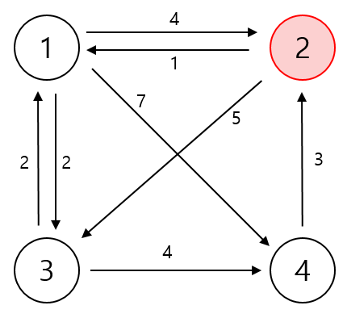
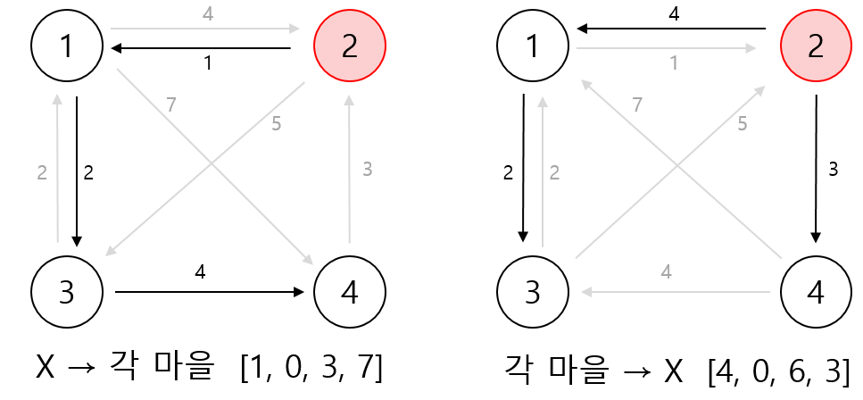

# 파티


### 문제

- N개의 숫자로 구분된 각각의 마을에 학생이 살고있다
- 각 마을 사이에는 총 M개의 <u>단방향 도로</u>가 있고  i번째 길을 지나는데 Ti(1 ≤ Ti ≤ 100)의 시간을 소비한다
- 마을 X (1 ≤ X ≤ N) 에서 파티가 열릴 때, <u>오고 가는데 가장 많은 시간을 소비하는 학생은 누구일지 구하라</u>

[문제보기](https://www.acmicpc.net/problem/1238)


### 입력

- N(1 ≤ N ≤ 1,000), M(1 ≤ M ≤ 10,000), X가 공백으로 구분되어 입력된다
- 두 번째 줄부터 M+1번째 줄까지 i번째 도로의 시작점, 끝점, 그리고 이 도로를 지나는데 필요한 소요시간 Ti가 들어온다
- 시작점과 끝점이 같은 도로는 없으며, 시작점과 한 도시 A에서 다른 도시 B로 가는 도로의 개수는 최대 1개이다.

- 모든 학생들은 집에서 X에 갈수 있고, X에서 집으로 돌아올 수 있는 데이터만 입력으로 주어진다.


### 접근 방법

1. **처음 접근 방법**

- X 기준으로 다익스트라를 한다
- X 기준으로 가장 멀리 떨어져있는 학생과 시간을 구한다
- 그 학생을 기준으로 다익스트라를 한다
- X까지의 소요되는 시간을 구해서 더한다

> 파티가 끝나고 집으로 돌아가는 시간(X에서 각 마을로)이 가장 오래 걸리는 학생은 구할 수 있지만
>
> 그 학생이 파티를 하러 가는 시간(해당 마을에서 X로)이 가장 오래 걸리는 학생은 아니다
>
> > 그럼 X를 제외한 모든 정점에 대해서 다익스트라?
> >
> > --> 시간이 너무 오래걸린다


2. **다음 접근 방법**

- X 기준으로 다익스트라를 한다 ( X 에서 각 마을로 )
- **<u>단방향으로 주어진 간선을 반전시킨다</u>**
- X 기준으로 다익스트라를 한다 ( 각 마을에서 X 로  )


#### 예제



#### 풀이




### 코드

```java
    static int N, M, X;
    static final int INF = Integer.MAX_VALUE;

    public static void main(String[] args) throws IOException {
        BufferedReader br = new BufferedReader(new InputStreamReader(System.in));
        StringTokenizer st = new StringTokenizer(br.readLine());

        N = Integer.parseInt(st.nextToken());
        M = Integer.parseInt(st.nextToken());
        X = Integer.parseInt(st.nextToken());

        ArrayList<Node>[] map = new ArrayList[N + 1];
        ArrayList<Node>[] reverseMap = new ArrayList[N + 1];

        for (int i = 0; i < map.length; i++) {
            map[i] = new ArrayList<>();
            reverseMap[i] = new ArrayList<>();
        }

        for (int i = 0; i < M; i++) {
            st = new StringTokenizer(br.readLine());
            int u = Integer.parseInt(st.nextToken());
            int v = Integer.parseInt(st.nextToken());
            int t = Integer.parseInt(st.nextToken());

            map[u].add(new Node(v, t));
            reverseMap[v].add(new Node(u, t));
        }

        // 파티 장소에서부터 각 정점까지의 최단 거리
        int[] partyPath = dijkstra(map, X);

        // 각 정점에서 파티 장소로 향하는 최단 거리
        int[] homePath = dijkstra(reverseMap, X);

        int answer = 0;
        for (int i = 1; i <= N; i++) {
            answer = Math.max(answer, partyPath[i] + homePath[i]);
        }


        System.out.println(answer);
    }

    private static int[] dijkstra(ArrayList<Node>[] map, int party) {
        PriorityQueue<Node> pq = new PriorityQueue<>();
        pq.add(new Node(party, 0));

        int[] dist = new int[map.length];
        Arrays.fill(dist, INF);

        dist[party] = 0;

        while (!pq.isEmpty()) {
            Node now = pq.poll();

            if (now.time > dist[now.no]) continue;

            for (Node next : map[now.no]) {
                if (dist[next.no] > dist[now.no] + next.time) {
                    dist[next.no] = dist[now.no] + next.time;
                    pq.add(new Node(next.no, dist[next.no]));
                }
            }
        }

        return dist;
    }

    static class Node implements Comparable<Node> {
        int no, time;

        Node(int no, int time) {
            this.no = no;
            this.time = time;
        }

        @Override
        public int compareTo(Node o) {
            return this.time - o.time;
        }
    }
```

