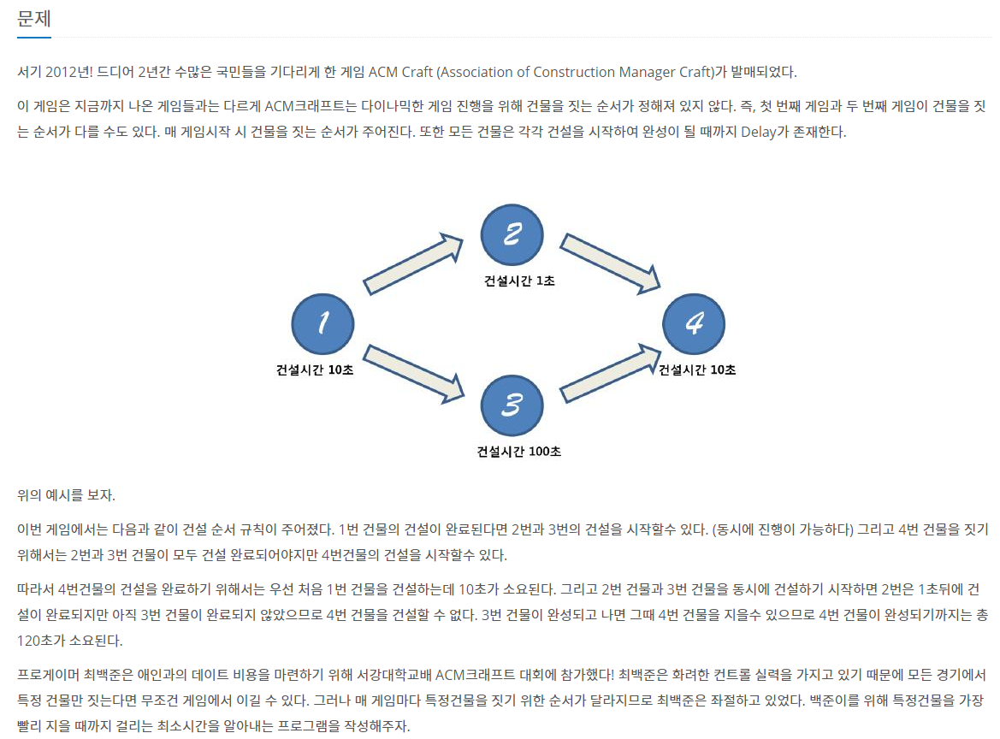
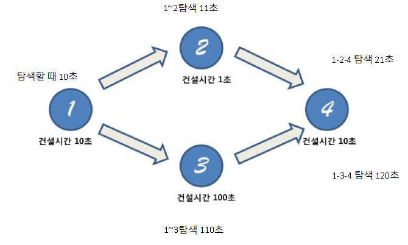

### ACM Craft



- On(N)


##### 사용한 알고리즘

- Topology Sort


##### 풀이 로직

- 건물을 짓는데 우선순위가 있으므로 진입 차수를 계산하여 풀이한다.

- 해당 건물들이 지어지는 시간을 담는 배열에 담아 위상정렬을 이용해 최소시간을 갱신해준다.

- 특정 건물을 짓는데 걸리는 총 시간은 위상정렬을 이용하여 해당 건물을 탐색할 때 걸리는 시간들 중 최댓값이다.

  ex)

  

  예시에서 4를 탐색 할 때를 보면 21초와 120초가 탐색되는데 4는 2와 3 모두 완성했을 때만 지을 수 있으므로 120초로 갱신해야 한다.

  

  

##### 조건

1. N <= 1000
2. K<=100000
3. D<=100000
4. 특정 건물을 지어야 해당 건물을 지을 수 있는 우선순위가 존재한다.


##### Code

```javascript
from collections import deque
import sys
input = sys.stdin.readline

def bfs(start, L):
	// 위상정렬 시작
    q = deque(start)
	// 돌기 전에 최소시간 배열에 걸리는 시간을 담아주었다. (시작점들은 해당 건물만 지으면 된다.)
    for i in start:
        spend[i] = time[i]
    while q:
        cur = q.popleft()
        t = spend[cur]
		// 위상정렬을 돌면서 최소시간 배열에 탐색한 값들을 최대값으로 갱신해준다.
        for nxt in narr[cur]:
            indegree[nxt] -= 1
            spend[nxt] = max(t+time[nxt], spend[nxt])
            if indegree[nxt] == 0:
                q.append(nxt)

for T in range(int(input())):
    n,k = map(int,input().split())
    time = [0] + list(map(int,input().split()))
    narr = [[] for _ in range(n+1)]
    // 각 노드의 진입차수를 담을 배열을 만든다.
    indegree = [0]*(n+1)
    spend = [0]*(n+1)
	// 진입차수 계산 시작
    for _ in range(k):
        s,e = map(int,input().split())
        narr[s].append(e)
        indegree[e] += 1
    L = int(input())
    start = []
	// 진입차수가 0인 노드가 시작점이 되므로 모두 start 배열에 넣어준다.
    for i in range(1,n+1):
        if indegree[i] == 0:
            start.append(i)
    bfs(start, L)
    print(spend[L])
```


##### 어려웠던 점

- 처음에는 최소시간이여서 다익스트라로 접근했는데 잘 풀리지 않았었다.

