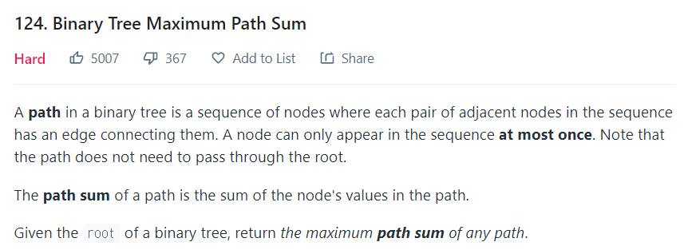

# Binary Tree Maximum Path Sum


### 문제



- 이진 트리의 path는 간선으로 연결된 인접한 노드 쌍의 시퀀스로 구성
- 노드는 최대 한번만 시퀀스에 나타날 수 있다
- 루트 노드를 통과할 필요는 없다


###  풀이

- 사용 알고리즘 : DFS


#### 처음엔 단순히 `왼쪽 자식 + 루트 + 오른쪽 자식` 만 최대 경로 합에 포함되는 줄 알았다

```
// [2,-1,null]
		2
     -1
output : 1
answer : 2

!! 자식 노드가 음수이거나 null이라면 루트 노드만 포함하여 최대 경로를 만들수 있구나..


// [4,-1,0,null,null,2,2]
	     4
     -1     0
          2   2
output : 4
answer : 6

!! 자식 노드를 포함하면서 루트의 부모 노드를 포함하는 최대 경로도 가능 하구나..
```


#### 정해

문제를 정리하면, 각 노드에 대해 최대 경로가 노드를 통과하는 방법은 5가지가 있다

1. 루트 노드만 경로에 포함되는 경우

   -> 양쪽 자식이 0 또는 음수인 경우

2. 루트 노드와 왼쪽 자식 노드만 포함되는 경우

   -> 왼쪽 자식이 오른쪽 자식보다 크거나, 오른쪽 자식이 음수인 경우

3. 루트 노드와 오른쪽 자식 노드만 포함되는 경우

   -> 오른쪽 자식이 왼쪽 자식보다 크거나, 왼쪽 자식이 음수인 경우

4. 2번 3번 케이스에서 루트 노드의 부모가 포함된 경우

5. 루트 노드와 양쪽 자식 모두 포함되는 경우


- 5가지 경로 탐색을 포함해 재귀를 돌며 최대 경로 합을 갱신해준다. 

- 또한 음수는 최대 합을 만드는데에 방해되는 요소이므로 배제 시켜준다


### 코드

```java
class BinaryTreeMaximumPathSum {
    static int max;

    public static int maxPathSum(TreeNode root) {
        max = Integer.MIN_VALUE;
        getPathSum(root);
        return max;
    }

    private static int getPathSum(TreeNode node) {
		// 리프노드까지 가기위한 탈출 조건
        if (node == null) return 0;

        // max를 0과 비교함으로써 음수는 배제를 해주어 1,2,3번 케이스 처리
        int leftValue = Math.max(0, getPathSum(node.left));
        int rightValue = Math.max(0, getPathSum(node.right));

        // 5번 케이스를 처리하기 위해 루트와 양쪽 자식들의 합을 구한뒤 최대값 갱신
        max = Math.max(max, leftValue + node.val + rightValue);

        // 4번 케이스(루트의 부모 포함)를 처리하기 위해
        // 루트+왼자, 루트+오른자 중 큰값을 리턴
        return Math.max(leftValue + node.val, node.val + rightValue);
    }
}
```

