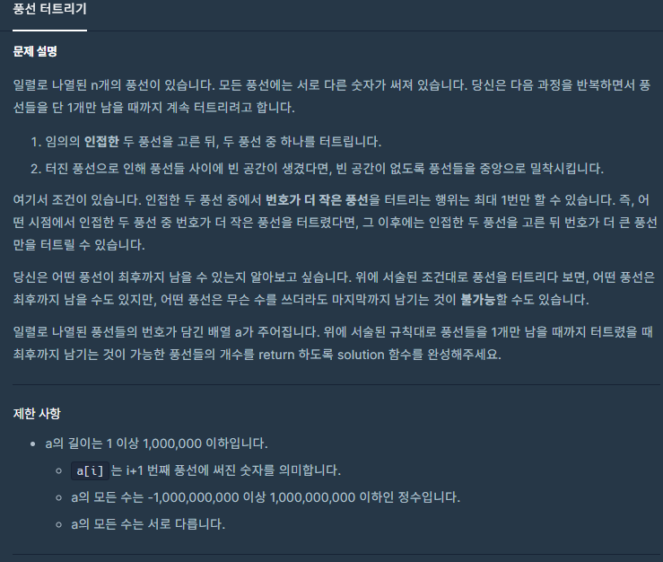
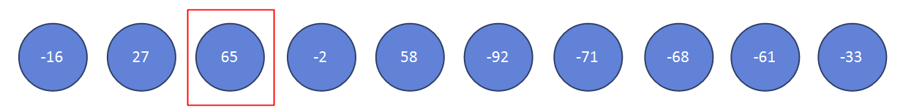

### 풍선 터트리기



- On(N)


##### 사용한 알고리즘

- ?


##### 풀이 로직

- 마지막까지 남을 수 있는 풍선을 골라야한다.

- 각 풍선을 기점으로 왼쪽과 오른쪽으로 나눌 수 있다.

  ex)

- 번호가 큰 풍선을 기본적으로 터트리고 번호가 작은 풍선을 터트리는 행위는 딱 1번만 할 수 있다.

- 때문에 풍선이 살아남으려면 자신 기준 왼쪽 풍선들의 최솟값과 오른쪽 풍선들의 최솟값 중에 어느 한쪽보다는 작아야 살아남을 수 있다 (번호가 작은 풍선을 터트리는 행위를 1번 할 수 있기 때문)

  


##### 조건

1. a <= 1000000
2. -1000000000 <= a[i] <= 1000000000
3. a의 모든 수는 서로 다르다.


##### Code

```javascript
function solution(a) {
    // 설명한 구조의 특성상 왼쪽 끝, 오른쪽 끝에 위치한 풍선은 무조건 살아남는다.
    var answer = 2;
    var n = a.length
    // 때문에 2이하의 n에 대하여 답은 n이다
    if (n < 2) return n
    // 오른쪽 왼쪽기준 최솟값을 구할것이므로 해당 배열에 큰값을 넣어준다.
    var lm = Array(n).fill(9999999999)
    var rm = Array(n).fill(9999999999)
    lm[0] = a[0]
    rm[n-1] = a[n-1]
    // 왼쪽부터 봤을 때 누적 최솟값 구하기
    for (var i=1; i<n; i++){
        lm[i] = Math.min(a[i],lm[i-1])
    }
    // 오른쪽부터 봤을 때 누적 최솟값 구하기
    for (var i=n-2; i>=0; i--){
        rm[i] = Math.min(a[i],rm[i+1])
    }
    // 둘다 구해졌다면 왼쪽 풍선과 오른쪽 풍선들의 최솟값중에 어느 한쪽보다는 작아야 하므로
    // 해당 위치에서 내가 누적 최솟값이 되는지 확인하면 된다.
    for (var i=1; i<n-1; i++){
        if (rm[i] == a[i] || lm[i] == a[i]) answer += 1
    }
    
    return answer;
}
```


##### 어려웠던 점

- 

