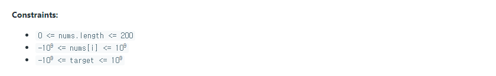

### 4Sum

- On(N^3)


##### 사용한 알고리즘

- Two Pointer


##### 풀이 로직

- nums 배열 중 4개를 골라 값을 구할 시 On(N^4)로 실행시간 초과가 발생한다.

- 때문에 배열을 정리해주고 a+b+c+d = target에서 a+b를 선택하고 Two Pointer를 통해 c와 d의 값을 결정하면 On(N^3) 으로 통과할 수 있다.


##### 조건

1. 배열에서 고른 임의의 4수의 합이 target이 되어야 한다.
2. Two Pointer를 이용해 임의의 두 수 c, d를 구해도 a, b를 포함한 다른 조합이 있을 수 있다. 때문에 left와 right를 모두 옮겨준다. (이전의 값을 이미 선택했기 때문)


##### Code

```python
class Solution:
    def fourSum(self, nums: List[int], target: int) -> List[List[int]]:
        n = len(nums)
        nums.sort()
        ans = []
        # a 선택, 뒤에 적어도 3개 이상의 수가 있어야한다
        for i in range(n-3):
            # b 선택
            for j in range(i+1,n-2):
                tsum = nums[i]+nums[j]
                l,r = j+1, n-1
                # Two Pointer를 통해 l,r 값을 갱신하면서 c, d를 찾는다.
                # 여기에서 배열을 sort했기 때문에 nums[l] <= nums[r]이 된다.
                while l < r:
                    # a,b,c,d를 다 더했을때 target보다 작다면 l을 옮기고 클때는 r을 옮긴다.
                    if tsum+nums[l]+nums[r] < target:
                        l += 1
                    elif tsum+nums[l]+nums[r] > target:
                        r -= 1
                    else:
                        # target과 같을 때 값을 추가해주고 또다른 c,d를 찾기위해 l과 r을 옮긴다.
                        ap = [nums[i], nums[j], nums[l], nums[r]]
                        if ap not in ans:
                            ans.append(ap)
                        l += 1
                        r -= 1
                            
        return ans
```


##### 어려웠던 점

- 최대 만족도를 구하는 것이기에 dp를 사용하려 했으나 인자가 여러개라 구현하기가 어려웠다.