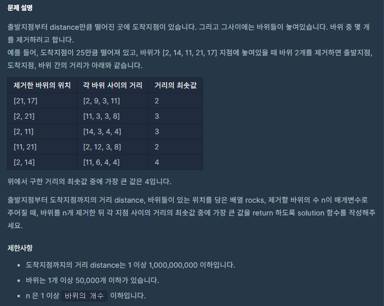
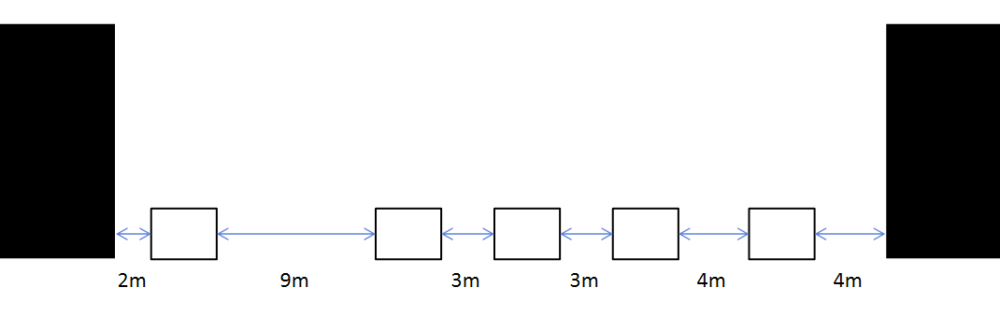
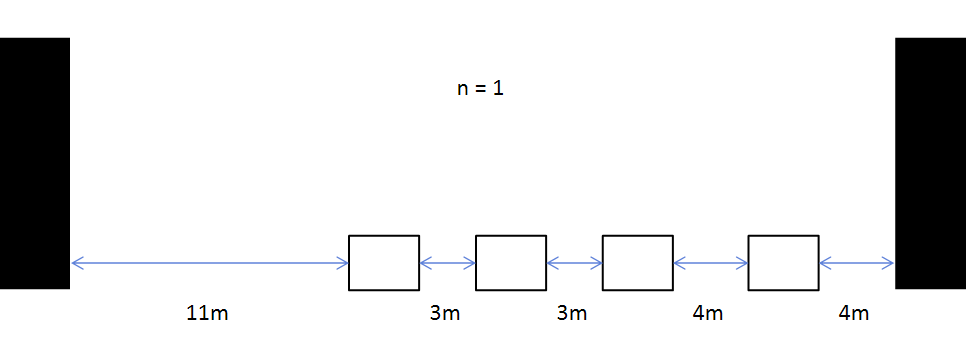
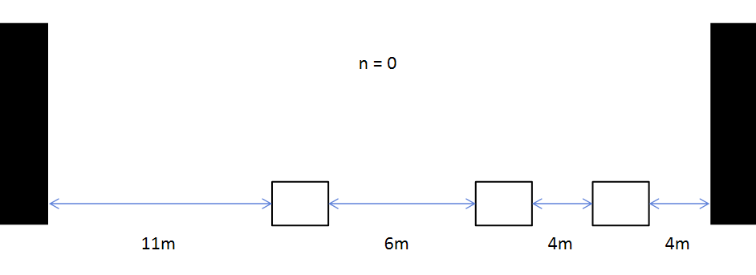
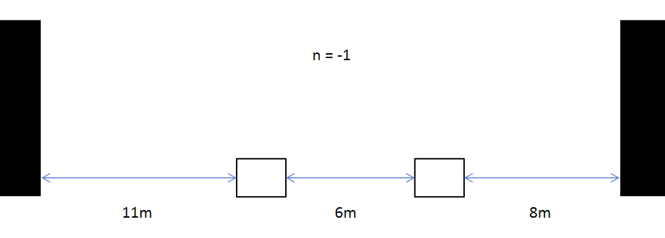

### 징검다리



- On(N log(N))


##### 사용한 알고리즘

- Binary Search


##### 풀이 로직

- distance가 1e9 라는 부분이 힌트!
- 바위의 개수가 50000개  1 <= n <= 바위의 개수 이므로 dfs로는 불가
- 거리의 최솟값을 미리 정해두고 징검다리를 건널 수 있는지를 확인해가면서 풀이
- 거리의 최솟값은 Binary Search를 이용하여 갱신해준다


##### 조건

1. 거리의 최솟값을 정해두고 돌 사이의 거리가 최솟값보다 작을 경우 돌을 하나씩 빼준다

2. n이 모자라게 되는 경우에는 최솟값을 너무 작게 잡아서 돌을 많이 뽑아야되는 경우!

3. n이 딱 맞거나 남는 경우에는 최솟값을 크거나 알맞게 잡았기 때문!

   ex)



- 최솟값을 3으로 잡았을 경우







##### Code

```python
def go(m, arr, n):
    # 시작점 초기화
    start = 0
    for i in range(len(arr)):
        # 현재 돌의 거리
        cur = arr[i]
        # 이분 탐색으로 정한 최솟값보다 돌 사이의 간격이 클 경우 -> 건너간다.
        if cur - start >= m:
            start = cur
            # 건너갔으므로 시작점은 현재위치!
        else:
            # 이분탐색으로 정한 최솟값보다 돌 사이의 간격이 작을 경우 -> 최솟값보다 작으면 최솟값이 아니므로 돌을 뽑아준다!
            n -= 1
            # 뽑는다.
            if n < 0:
                # 뽑을 수 있는 돌의 수를 다 썼는데 돌을 뽑았다면 True값 반환
                return True
    # 무사히 건넜을 경우 False값 반환
    return False

def solution(distance, rocks, n):
    answer = 0
    rocks.sort()
    rocks += [distance]
    l,r = 0, distance
    while l <= r:
        # 탐색할 최솟값을 결정한다.
        m = (l+r)//2
        # 징검다리를 건넌다.
        # True 값이라면 다 건너지 못한경우 (최솟값이 너무 크다)
        if go(m, rocks, n):
            r = m - 1
            # False 값이라면 다 건너간 경우 (최솟값이 적절하거나 작다!)
        else: l = m + 1
    # 이분탐색의 리턴값
    # 정답이 될수 있는 경우가 False값을 반환하는 구조이다!
    # m = (l+r)//2 이므로 l과 m 이 가까워졌을 때 l = m + 1 은 l++ 이 된다! 때문에 마지막 결정은 l == r 부분에서 진행하게된다!
    # 그렇다면 마지막 정답이 될 수 있는 답을 고를 경우 l = m + 1이 실행되게 되며 l <= r을 충족하지 못하게 된다!
    # 그러면 while문을 탈출하고 정답이였던 r을 리턴해주면 된다.
    return r

d,r,n = 25, [2, 14, 11, 21, 17], 2
solution(d,r,n)
```


##### 어려웠던 점

- 문제를 이해하는데 오래걸렸고 최솟값을 기준으로 이분탐색을 해야한다고 생각은 들었지만 로직을 짜는게 쉽지 않았다.