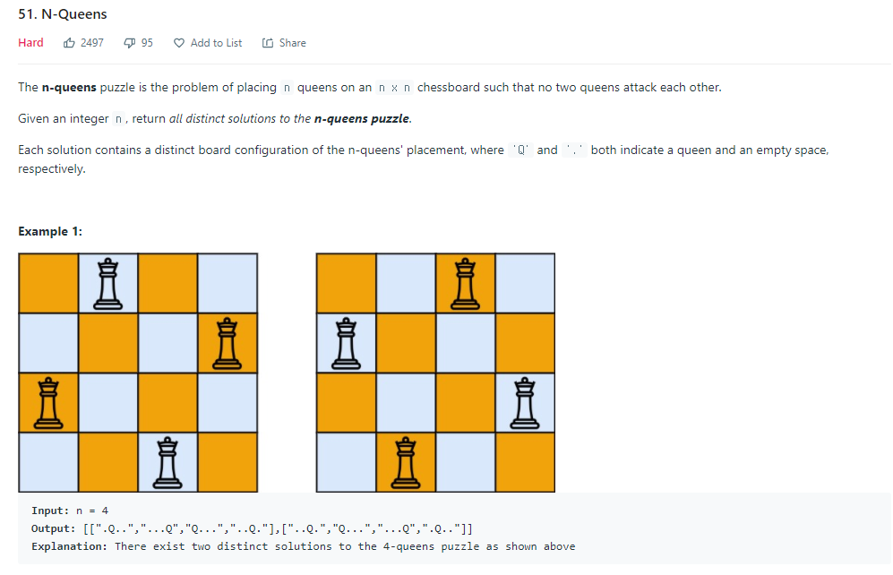

### N-Queens



- On(N**2)


##### 사용한 알고리즘

- Depth First Search
- Recursion


##### 풀이 로직

- 각 행마다 퀸을 배치한다.
- 다음 행으로 넘어갈때 앞에 배치한 퀸이 해당 퀸을 공격할 수 있는지를 확인한다.
- 모든 행을 돌지 않았는데 퀸을 놓을 자리가 없다면 전 단계의 퀸을 옮긴다.
  - 모든 행에 퀸을 배치할 수 있다면 이를 answer에 저장하고 재귀를 돌며 다른 배치를 찾는다.


##### 조건

1.  퀸을 배치할 때 서로 공격 받지 않는 위치에 배치한다


##### Code

```python
class Solution:
    def __init__(self):
        self.ans = []
   
    def solveNQueens(self, n: int) -> List[List[str]]:
        # n은 퀸의 갯수 idx는 행번호, pick은 행마다 몇번째에 퀸을 놓았는지를 저장하는 배열
        def put_Queen(n,idx=0,pick=[]):
            # 퀸을 모두 배치한 상태
            if idx == n:
                rs = []
                for i in pick:
                    row = ['.']*n
                    row[i] = 'Q'
                    rs.append(''.join(row))
                self.ans.append(rs)
                return
            
            for i in range(n):
                # 첫번째 퀸 배치때는 아무데나 놓아도 된다.
                if not pick:
                    put_Queen(n,idx+1,pick+[i])
                # 퀸의 공격방향 때문에 배치했던 열에는 퀸을 놓을 수 없다.
                elif i not in pick:
                    p = True
                    for k,v in enumerate(pick):
                        # 퀸은 대각선으로도 움직인다.
                        if abs(idx-k) == abs(i-v):
                            p = False
                    if p:
                        put_Queen(n,idx+1, pick+[i])
                
                
        put_Queen(n)
        return self.ans
```


##### 어려웠던 점

- 대각선 방향 체크를 제대로 하지 않아서 몇번 코드를 고쳤다.