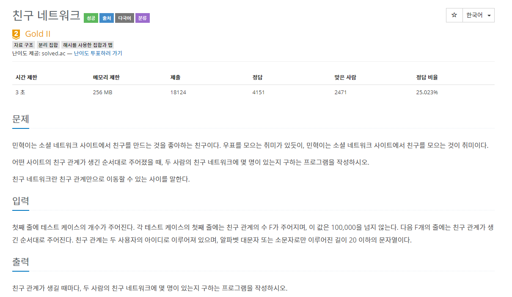
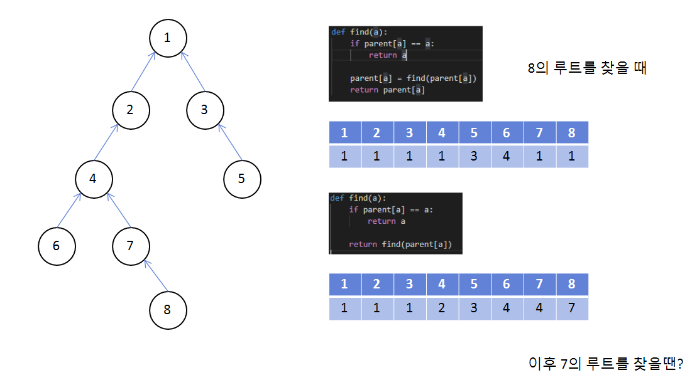

### 친구 네트워크



- On(N)


##### 사용한 알고리즘

- Union Find
- Hashing


##### 풀이 로직

- 해싱을 통해 Union Find를 하기위한 해시 테이블을 만든다.

- 새로운 친구를 input 받을 경우 부모를 저장하는 배열인 parent에 추가하고 자기 자신을 저장

- 해당 친구가 있을 경우에는 부모를 찾는다.

- 두개의 부모를 찾아 다르면 부모를 합친다. 합치는 과정에서 압축과정을 진행한다.

  ex)

  

- 부모를 합칠 때 각각의 트리의 노드 수를 합쳐서 저장해놓는다.


##### 조건

1.  친구 관계수가 100000 이므로 input이 굉장히 많아진다. 때문에 std.readline을 사용한다.


##### Code

```python
import sys
input = sys.stdin.readline
# input을 상당히 많이 받기 때문에 시간을 단축시켜주는 stdin.readline을 사용한다

def merge(a,b):
    # 각각의 부모찾기
    u = find(a)
    v = find(b)
    # 부모가 같다면 해당 부모의 자식들의 합 리턴!
    if u == v:
        return sumset[u]
    # 다르다면 부모를 합쳐준다. 여기서 순서는 상관없다.
    else:
        parent[v] = u
        # 합쳐지는 부모가 이루는 노드 수를 합치기!
        sumset[u] += sumset[v]
        return sumset[u]


def find(a):
    # 자기 자신이 부모면 루트노드!
    if parent[a] == a:
        return a
    
    # 아닐 경우는 재귀를 통해 해당 부모를 찾아온다.
    # 여기에서 압축과정을 해주어야 다음번에 거쳐갔던 자식들이 부모를 찾을 때 한번에 찾을 수 있다! 
    parent[a] = find(parent[a])
    return parent[a]

for T in range(1,int(input())+1):
    f = int(input())
    ht = {}
    # 루트노드가 배열 (index가 노드번호 value가 루트노드의 번호)
    parent = [0]
    cnt = 1
    # 노드들이 갖는 서브트리의 노드 수
    sumset = [0]
    for _ in range(f):
        a, b = input().split()
        # 나오지 않은 이름일 때
        if not ht.get(a):
            ht[a] = cnt
            parent.append(cnt)
            sumset.append(1)
            cnt += 1
        if not ht.get(b):
            ht[b] = cnt
            parent.append(cnt)
            sumset.append(1)
            cnt += 1
        # 위 과정을 거치면 반드시 ht[a], ht[b]가 존재한다. 각각의 값은 해당 사람이 온 번호
        print(merge(ht[a],ht[b]))
    

```


##### 어려웠던 점

- 처음에는 해싱 후 다익스트라를 이용하려고 해서 고생을 많이했다.