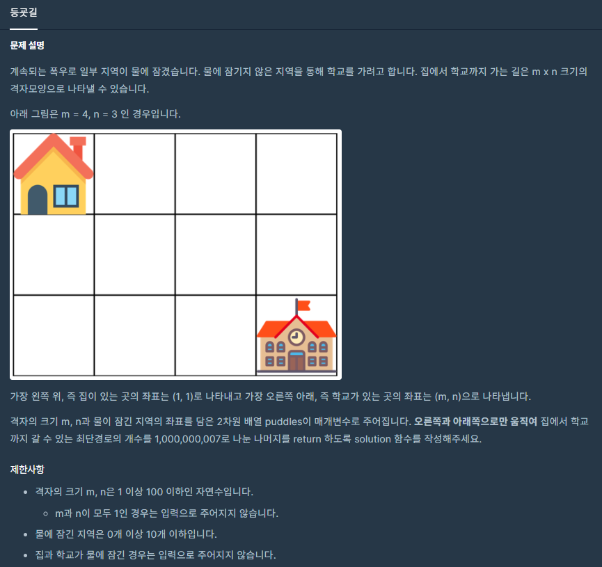

### 등굣길



- On(N**2)


##### 사용한 알고리즘

- Dynamic Programming
- Depth First Search


##### 풀이 로직

- 12월 3주차 내리막길과 비슷하다고 생각
- dfs를 돌면서 학교에 도착할 수 있으면 return 1을 해주고 이미 내가 학교까지 도착한 길이라면 해당 값을 dp에 더해준다.


##### 조건

1.  puddles 부분은 지나가지 못한다.
2.  최단 경로의 개수를 1000000007로 나누어주어야한다.


##### Code

```python
def go(x,y,arr,dp,dx,dy):
    n = len(dp)
    m = len(dp[0])
    if x == n-1 and y == m-1:
        dp[x][y] = 1
        return dp[x][y]
    dp[x][y] = 0
    # 오른쪽과 아래로만 움직일 수 있다.
    for i in range(2):
        xi = dx[i] + x
        yi = dy[i] + y
        # puddles 부분을 1로 바꿔줬기 때문에 0인 부분만 탐색
        if 0<=xi<n and 0<=yi<m and arr[xi][yi] == 0:
            # 내가 갔던길이라면 dp에 더해준다.
            if dp[xi][yi] != -1:
                dp[x][y] += dp[xi][yi]
            # 가지 않았던 길은 탐색한다.
            else:
                dp[x][y] += go(xi,yi,arr,dp,dx,dy)
    # 길을 탐색하고 난 뒤 dp에 더해주기 위해 dp[x][y] 를 리턴!
    return dp[x][y]

def solution(m, n, puddles):
    dx = [1,0]
    dy = [0,1]
    arr = [[0]*m for i in range(n)]
    for x,y in puddles:
        arr[x-1][y-1] = 1
    dp = [[-1]*m for i in range(n)]
    return go(0,0,arr,dp,dx,dy)
    

m,n,p = 4, 3, [[2, 2]]
print(solution(m,n,p))
```


##### 어려웠던 점

- 