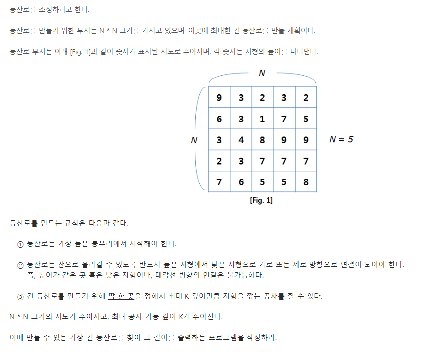
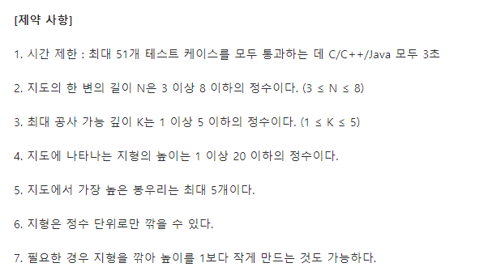

### 등산로 조성



- On(K*N**2)


##### 사용한 알고리즘

- Depth First Search


##### 풀이 로직

- dfs를 돌면서 등산로를 조성!
- 딱 한번 가지못하는 길을 현재 높이 -1 까지 깎아서 이동할 수 있다 (단 깎는 높이는 k 이하)
- 깎은 경우를 arr에 표기해주어야 다음 길을 갈때도 연산에 문제가 안생긴다. (arr를 안바꾸고 vis만 통과 시켰더니 이후에 문제가 발생했다.) 


##### 조건




##### Code

```python
def go(x,y,k,rs=1):
    global ans
    # 목표위치가 없음으로 항상 ans를 확인해준다.
    ans = max(rs,ans)
    vis[x][y] = 1
    for i in range(4):
        xi,yi = x+dx[i], y+dy[i]
        if 0<=xi<n and 0<=yi<n and vis[xi][yi] == 0:
            # 등산로의 다음 길이 같거나 현재위치보다 클경우
            if arr[xi][yi] >= arr[x][y]:
                temp = arr[xi][yi] - arr[x][y] + 1
                # k만큼 깎아서 현재보다 1 낮은 높이를 만들 수 있는지 확인
                if temp <= k:
                    # 깎은 지역을 표시했다가
                    arr[xi][yi] -= temp
                    go(xi,yi,0,rs+1)
                    # dfs를 빠져나올때 다시 올려준다.
                    arr[xi][yi] += temp
            else:
                # 내리막길인 경우에는 그냥 다음으로 넘어간다.
                go(xi,yi,k,rs+1)
    # 마찬가지로 해당 경로를 빠져나갈 때 visit을 초기화
    vis[x][y] = 0
                

dx = [-1,0,1,0]
dy = [0,1,0,-1]
for T in range(1,int(input())+1):
    ans = 0
    n,k = map(int,input().split())
    vis = [[0]*n for i in range(n)]
    arr = [list(map(int,input().split())) for i in range(n)]
    start = []
    start_max = 0
    for i in range(n):
        for j in range(n):
            # 시작점들을 모아주는 과정
            if arr[i][j] > start_max:
                # 최대 높이가 바뀔경우 start를 초기화
                start = []
                start_max = arr[i][j]
                start.append([i,j])
            elif arr[i][j] == start_max:
                start.append([i,j])

    for x,y in start:
        # 봉우리들을 돌면서 dfs시작
        go(x,y,k)

    print(f'#{T} {ans}')

```


##### 어려웠던 점

- 