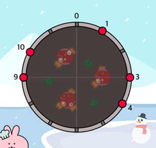
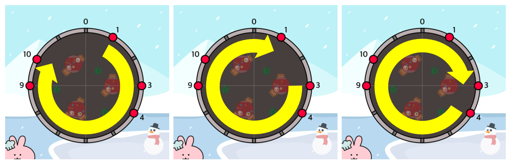

# 외벽 점검


### 문제

- 레스토랑 내부가 너무 낡아 외벽 점검을 해야한다
- 레스토랑의 구조는 <u>완전히 동그란 모양</u>이고 <u>외벽의 총 둘레는 n 미터</u>이다
- 외벽의 몇몇 취약한 지점들이 있는데 이 지점들을 주기적으로 친구를 보내 점검하기로 했다
- 빠른 공사 진행을 위해 점검 시간은 1시간으로 제한하고, <u>친구들이 1시간동안 이동할 수 있는 거리는 정해져 있다</u>
- 또한 친구들은 출발 지점에서 시계, 반시계 방향으로 외벽을 따라서만 이동 가능하다

<br>

- 외벽의 길이 n,
- 취약 지점의 위치가 담긴 배열 weak,
- 각 친구가 1시간 동안 이동할 수 있는 거리가 담긴 배열 dist

위와 같이 매개변수가 주어질 때, <u>취약 지점을 점검하기 위해 보내야 하는 친구 수의 최소값을 return</u> 하도록 solution 함수를 완성하라


<br>

### 제한 사항

- n은 1 이상 200 이하인 자연수입니다.
- weak의 길이는 1 이상 15 이하입니다.
  - 서로 다른 두 취약점의 위치가 같은 경우는 주어지지 않습니다.
  - 취약 지점의 위치는 오름차순으로 정렬되어 주어집니다.
  - weak의 원소는 0 이상 n - 1 이하인 정수입니다.
- dist의 길이는 1 이상 8 이하입니다.
  - dist의 원소는 1 이상 100 이하인 자연수입니다.
- 친구들을 모두 투입해도 취약 지점을 전부 점검할 수 없는 경우에는 -1을 return 해주세요.


### 접근 방식

> 주어진 입력의 크기가 작기도하고
>
> 효율적인 어떤 방식?이 떠오르지 않아서, 모든 경우를 탐색해야겠다고 생각했다
>
> <br>
>
> 원형으로 배열을 만들어 모든 지점, 모든 친구들에 대해서 탐색하기로 결정


1. 각 취약 지점에서 다음 취약 지점까지의 거리를 담고있는 배열을 만든다

   외벽은 원형이므로 마지막 취약 지점에서 처음 취약 지점의 거리는 weak[처음] + n - weak[마지막]



```java
// n = 12 , weak = [1, 3, 4, 9, 10] , dist = [3, 5, 7]

map = new int[weak.length];
for (int i = 0; i < weak.length; i++) {
    if (i == weak.length - 1) {
        map[i] = weak[0] + n - weak[i];
        continue;
    }
    map[i] = weak[i + 1] - weak[i];
}
// map = [2, 1, 5, 1, 3]
```

<br>

2. 친구를 투입해보는 모든 경우의 수를 구한 뒤, 그 인원으로 점검을 할 수있는지 체크한다

```java
// in solution method
// 1명 투입부터 전체 인원 투입까지
for (int i = 1; i <= dist.length; i++) {
    visited = new boolean[dist.length];
    permutation(dist, i, new ArrayList<>());
}


private static void permutation(int[] dist, int max, ArrayList<Integer> friends) {
    if (friends.size() == max) {
        checkWall(friends);
        return;
    }

    for (int i = 0; i < dist.length; i++) {
        if (visited[i]) continue;

        friends.add(dist[i]);
        visited[i] = true;
        permutation(dist, max, friends);
        visited[i] = false;
        friends.remove(friends.size() - 1);
    }
}
```

<br>

3. 외벽 점검은 주어진 인원으로 모든 지점에서 시행해본다



<br>

```java
private static void checkWall(ArrayList<Integer> friends) {
	// 출발 취약 지점
    for (int start = 0; start < map.length; start++) {
        // 주어진 인원으로 점검을 하지 못한 경우를 판별하기 위한 플래그
        boolean flag = true;
        // 친구의 인덱스
        int idx = 0;
        // 누적 거리
        int sum = 0;
        for (int i = start; i < start + map.length; i++) {
            int cur = map[i % map.length];

            sum += cur;

            if (idx >= friends.size()) {
                flag = false;
                break;
            }
			
            // 현재 친구가 점검하지 못하는 경우라면
            if (friends.get(idx) < sum) {
                // 다음 친구 투입
                idx++;
                // 누적거리 0으로 초기화(다음 지점부터 다음 친구로 새로 시작)
                sum = 0;
            }
        }
        // 주어진 인원으로 모두 점검을 했다면
        // 최소 투입 인원 갱신
        if (flag) {
            answer = Math.min(answer, friends.size());
            break;
        }
    }
}
```


### 소스 코드

```java
package _1월5주차;

import java.util.ArrayList;

public class 외벽점검 {
    static int N, F, answer;
    static int[] map;
    static boolean[] visited;

    public static int solution(int n, int[] weak, int[] dist) {
        N = n;              // 벽 길이
        F = dist.length;    // 총 친구 수

        map = new int[weak.length];
        for (int i = 0; i < weak.length; i++) {
            if (i == weak.length - 1) {
                map[i] = weak[0] + n - weak[i];
                continue;
            }
            map[i] = weak[i + 1] - weak[i];
        }

        answer = Integer.MAX_VALUE;

        for (int i = 1; i <= dist.length; i++) {
            visited = new boolean[dist.length];
            permutation(dist, i, new ArrayList<>());
        }

        return answer == Integer.MAX_VALUE ? -1 : answer;
    }

    private static void permutation(int[] dist, int max, ArrayList<Integer> friends) {
        if (friends.size() == max) {
            checkWall(friends);
            return;
        }

        for (int i = 0; i < dist.length; i++) {
            if (visited[i]) continue;

            friends.add(dist[i]);
            visited[i] = true;
            permutation(dist, max, friends);
            visited[i] = false;
            friends.remove(friends.size() - 1);
        }
    }

    private static void checkWall(ArrayList<Integer> friends) {
        for (int start = 0; start < map.length; start++) {
            boolean flag = true;
            int idx = 0;
            int sum = 0;
            for (int i = start; i < start + map.length; i++) {
                int cur = map[i % map.length];

                sum += cur;

                if (idx >= friends.size()) {
                    flag = false;
                    break;
                }

                if (friends.get(idx) < sum) {
                    idx++;
                    sum = 0;
                }
            }
            if (flag) {
                answer = Math.min(answer, friends.size());
                break;
            }
        }
    }
}

```


### 어려웠던 점

큰 틀에서의 풀이 로직은 빠르게 떠올랐는데

투입할 친구를 선정한 뒤 모든 취약 지점을 돌며 검사를 하는 방식(chekWall( )) 구현이 어려웠다