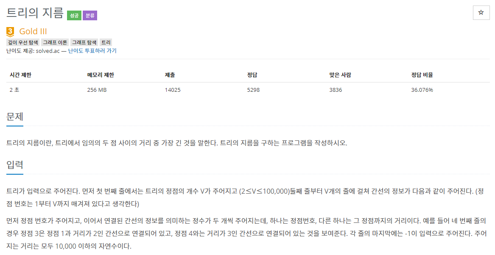
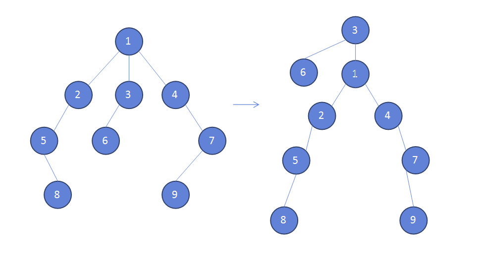

### 트리의 지름



- On(E+VlogV)


##### 사용한 알고리즘

- Prim's algorithm


##### 풀이 로직

- 트리를 탐색하면서 아무지점에서 끝까지의 거리가 가장 큰 값을 잡는다.

- 가장 큰 값인 노드에서 부터 다시 트리를 탐색하면서 가장 멀리있는 노드를 찾으면 해당 노드가 가장 큰 길이가 된다 (트리의 특성)

  ex)

  

  PPT 에서 각각의 선을 연결하면 트리 구조를 만들 수 있는데 아무 노드나 최상단에 올리면 이를 루트로 하는 새로운 트리를 만들 수 있다! 

  

##### 조건

1. V <= 100000
2. 간선 정보는 정확히 존재하지 않는다.


##### Code

```javascript
import sys
from heapq import heappush, heappop
input = sys.stdin.readline

// 프림을 이용하여 다익스트라 구현
def prim(s):
	// 프림에서는 항상 최댓값을 cost로 지정해주고
    cost = [sys.maxsize]*(v+1)
    cost[0] = 0
    cost[s] = 0
    q = []
    heappush(q,[0,s])
	// 노드를 뽑아나가면서 cost[node] 값을 계속 최솟값으로 갱신해준다.
    while q:
        val, node = heappop(q)
		// 힙큐를 이용하기 때문에 항상 시간이 적게 걸리는 노드가 먼저 나오게 되고
        if cost[node] < val:
            continue
        for nv, nxt in narr[node]:
            nv += val
			// 이 부분을 통해 힙큐에 푸시를 하기 때문에 중복계산이 없어진다. (visit 체크 불필요)
            if cost[nxt] > nv:
                cost[nxt] = nv
                heappush(q,[nv,nxt])
	// 프림에서 중요한 정보는 cost배열이다.
	// 여기에서 sum을 통해 총 거리를 계산하거나 누적값을 갱신하여 제일 큰값을 가져온다.
    return cost

v = int(input())
narr = [[] for i in range(v+1)]
// 초기화 부분
for _ in range(v):
    data = list(map(int,input().split()))
    s = data.pop(0)
    data.pop()
	// 처음 노드번호와 마지막 -1 을 빼주고 반만큼 돌면 인접노드의 갯수만큼 돌 수 있다.
    for i in range(len(data)//2):
        e = data[i*2]
        val = data[i*2+1]
        narr[s].append([val,e])

// 현재 1이 루트인지 아닌지 확실히 알 수 없기 때문에 프림을 한번 돌려서 가장 멀리있는 지점을 구한다.
rs = prim(1)
// 가장 멀리있는 지점을 루트로 해서 가장 멀리있는 지점을 구하면 트리의 총 지름을 구할 수 있다.
start = rs.index(max(rs))
// 루트노드를 정하고 다시 프림을 돌리는 과정
ans = prim(start)
// 가장 높은 큰 값이 트리의 지름이 된다.(끝에서 끝까지의 거리)
print(max(ans))
```


##### 어려웠던 점

- 가중치가 있는 트리여서 논리가 정확한지 생각해 보는데 오래걸렸다.

