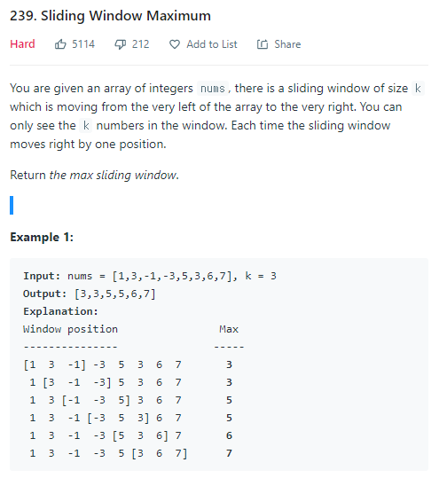

### Sliding Window Maximum




##### 제한 조건

- nums.length <= 10^5
- -10^4 <= nums[i] <= 10^4
- k <= nums.length


##### 사용한 알고리즘

- Binary Search (N log N)을 이용한 Push, Pop


##### 풀이 로직

- nums의 길이가 10만이므로 n log n 풀이로 접근했다.
- Window가 보고있는 k갯수를 맞춘 뒤 소트를 이용하여 정렬을 해준다.
- 이후에 for문을 돌면서 Window에서 빠져야 하는 수를 queue에서 빼준다.
- 그다음 Window에 들어오는 수를 queue에 넣어준다.
- queue에 넣고 뺄때 이분 탐색을 이용하여 정렬을 유지하게끔 해준다.


##### Code

```javascript
// 이분 탐색하여 index를 반환
function bnsearch(x,arr){
    let l=0, r=arr.length-1
    while (l<=r){
        let m=parseInt((l+r)/2)
        if (x > arr[m]){
            l = m + 1
        } else {
            r = m-1
        }
    }
    return l
}


var maxSlidingWindow = function(nums, k) {
    const que = []
    const ans = []
    for (let i=0; i<k; i++){
        que.push(nums[i])
    }
    que.sort((a,b)=>{
        return a-b
    })
    // que에 k개를 집어넣고 sort해준다.
    ans.push(que[que.length-1])
    // que는 항상 정렬된 상태이므로 마지막에 있는 수가 Window의 최대
    
    // console.log(que)
    for (let i=k; i<nums.length; i++){
        // 삭제할 인덱스 구하기
        let didx = bnsearch(nums[i-k],que)
        que.splice(didx,1)
        // 추가할 인덱스 구하기
        let nidx = bnsearch(nums[i],que)
        if (nidx == k){
            que.push(nums[i])
        } else {
            que.splice(nidx,0,nums[i])
        }
        ans.push(que[que.length-1])
        // console.log(que)
    }
    return ans
};
```


##### 어려웠던 점

- 배열에서 해당 인덱스를 빼고 삽입하는 부분에서도 시간을 많이 소요하기 때문에 n log n이라고 생각하고 풀었음에도 실행속도가 상당히 느렸다.
- python 에서는 아예 시간 초과가 났다!

