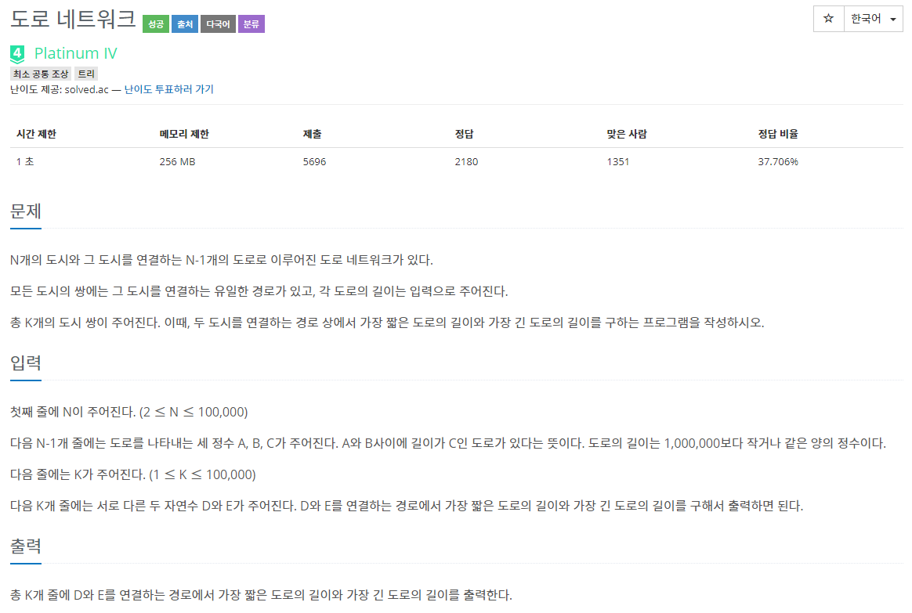

### 도로 네트워크




##### 사용한 알고리즘

- Lowest Common Ancestor (K logN)


##### 풀이 로직

- 최소 공통 조상 DP를 생성한다.
- 구해야 하는것은 두 도시를 연결하는 경로 상에서 가장 짧은 도로의 길이와 가장 긴 도로의 길이이다.
- 때문에 DP(node)(jump) = (pnode, min, max) 로 하는 3차원 배열을 생성한다.
- LCA DP를 초기화 한 후 LCA를 진행한다.


##### Code

```python
import sys
from math import log2
# dp를 만들어 주는 부분에서 트리가 편향될 수 있으므로 재귀가 10만까지 들어갈 수 있다.
sys.setrecursionlimit(100000)
input = sys.stdin.readline

# LCA의 진행
def find(a,b):
    # 최소, 최대거리를 초기화
    mn,mx = 1e7,0
    # a,b의 깊이가 같지않다면 깊이를 맞춰준다.
    if depth[a] != depth[b]:
        for i in range(maxLevel-1,-1,-1):
            if depth[dp[a][i][0]] >= depth[b]:
                # 깊이를 맞춰주면서 생기는 최소 길이, 최대 길이를 저장한다.
                mn = min(mn,dp[a][i][1])
                mx = max(mx,dp[a][i][2])
                a = dp[a][i][0]
    
    # a,b 가 같으면 b가 a의 공통 조상이므로 mn,mx가 구해져있다.
    if a == b:
        print(mn,mx)
        return

    # 아니면 a,b의 조상이 달라지는 부분 중 가장 높은 노드로 이동한다
    for i in range(maxLevel-1,-1,-1):
        if dp[a][i][0] != dp[b][i][0] and dp[a][i][0] != 0 and dp[b][i][0] != 0:
            mn = min(mn,dp[a][i][1],dp[b][i][1])
            mx = max(mx,dp[a][i][2],dp[b][i][2])
            a = dp[a][i][0]
            b = dp[b][i][0]
    # 부모노드가 무조건 공통조상이 된다.
    # 때문에 mn,mx를 마지막으로 계산해준다.
    mn = min(mn,dp[a][0][1],dp[b][0][1])
    mx = max(mx,dp[a][0][2],dp[b][0][2])
    print(mn, mx)
    return

def makeDP(cur, par, val=0):
    # LCA Tree 생성 시작
    # 자식 노드의 깊이는 부모 노드 깊이보다 1만큼 깊다.
    depth[cur] = depth[par] + 1
    # 각각 cur에서 0번 점프한 노드(조상), 최소 길이, 최대 길이
    dp[cur][0][0] = par
    dp[cur][0][1] = min(dp[cur][0][1], val)
    dp[cur][0][2] = max(dp[cur][0][2], val)

    # 해당 부분에서 아래와 같이 계산해주었는데 LCA트리가 잘 생성되지 않아서 틀렸습니다가 떴다.
    # 때문에 makeDP함수 밑에서 for문을 이용하여 트리를 초기화 해주었다.
    for i in range(1,maxLevel):
        jump = dp[cur][i-1]
        dp[cur][i][0] = dp[jump[0]][i-1][0] # 이부분 까지는 초기화를 해주어야 밑에서 조상을 찾아서 정보를 초기화한다.
		...
    # ==========================================================================
    
    # 해당 노드의 자식들을 이용해 Tree를 계속 만들어나간다.
    for nval, nxt in narr[cur]:
        if nxt != par:
            makeDP(nxt, cur, nval)

n = int(input())
narr = [[] for _ in range(n+1)]

for _ in range(n-1):
    a,b,val = map(int,input().split())
    narr[a].append([val, b])
    narr[b].append([val,a])

maxLevel = int(log2(n)) + 1
dp = [[[0,1e7,0] for i in range(maxLevel)] for i in range(n+1)]
# dp[node][jump][0:node, 1:min, 2:max]
# LCA에서는 depth를 이용하여 공통조상을 찾기때문에 depth배열을 만들어서 각 노드의 depth를 저장한다.
depth = [-1]*(n+1)
makeDP(1,0)

# LCA 트리의 min, max 부분을 완성해주는 작업
for i in range(1,maxLevel):
    for j in range(1,n+1):
        jump = dp[j][i-1][0]
        dp[j][i][1] = min(dp[j][i-1][1], dp[jump][i-1][1])
        dp[j][i][2] = max(dp[j][i-1][2], dp[jump][i-1][2])


# for i in dp:
#     print(i)

k = int(input())
for _ in range(k):
    a,b = map(int,input().split())
    if depth[a] < depth[b]:
        find(b,a)
    else:
        find(a,b)

```


##### 어려웠던 점

- 트리의 jump 부분 계산을 재귀 안에서 실행하려고 했는데 잘 되지 않아서 시간이 오래걸렸다.
- while과 for문을 이용하여 a,b의 깊이와 LCA를 계산했었는데 for문을 거꾸로 하면 while을 사용하지 않고도 깊이 0 부분까지 계산할 수 있다.

