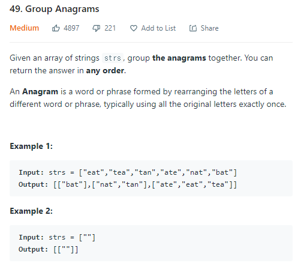
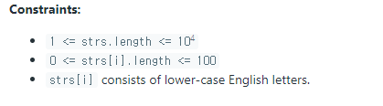

### Group Anagrams





##### 사용한 알고리즘

- Hash - O(nm)


##### 풀이 로직

- strs의 원소들을 확인하며 알파벳의 갯수를 세는 배열을 만들어 갯수들을 계산한다.
- 해당 배열을 join을 통해 string으로 변경한다(구분자가 들어있는 string)
- 이를 key값으로 해시에 저장하고 해당 원소를 담는 배열을 만들어준다.
- 이후에 해당 key가 존재한다면 배열에 원소를 push해준다. 


##### Code

```javascript
/**
 * @param {string[]} strs
 * @return {string[][]}
 */


var groupAnagrams = function(strs) {
    // 해시 생성
    const ht = {}
    // 각각의 원소들을 돌면서 key로 사용할 string을 만든다.
    strs.forEach(str=>{
        let alpha = Array(26).fill(0)
        for (let i=0; i<str.length; i++){
            alpha[str.charCodeAt(i)-'a'.charCodeAt()] += 1
        }
        target = alpha.join()
        if (ht[target]){
            ht[target].push(str)
        } else{
            ht[target] = []
            ht[target].push(str)
        }
    })
    // 만들어진 모든 key를 돌면서 ans 배열에 key에 해당하는 배열을 넣어준다.
    let keys = Object.keys(ht)
    const ans = Array(keys.length)
    for (let i=0; i<keys.length; i++){
        ans[i] = []
    }
    keys.forEach((key,idx)=>{
        ht[key].forEach(val=>{
            ans[idx].push(val)
        })
    })
    
    return ans
};
```


##### 문제 풀이를 진행하며

- 각각의 원소들을 모두 sort한 후 해당 값들을 비교하며 넣어주는 방안도 생각했지만 O(nmlogm) 으로 현재 코드보다 느렸다. (차이가 많이나진 않는다)

- 구분자를 넣지 않고 join을 했을때 문제가 생겼었다.

  구분자를 넣지 않으면 ['0','11','0','0'] 과 ['0','1','10','0'] 를 구분하지 못했다. 

