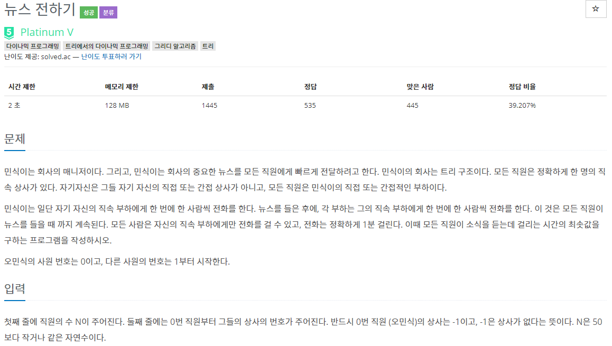
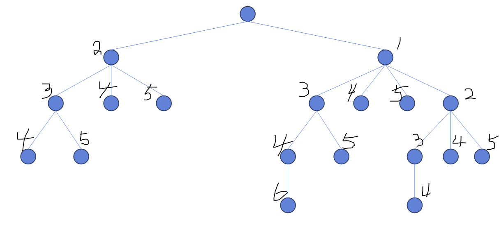
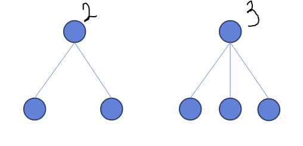
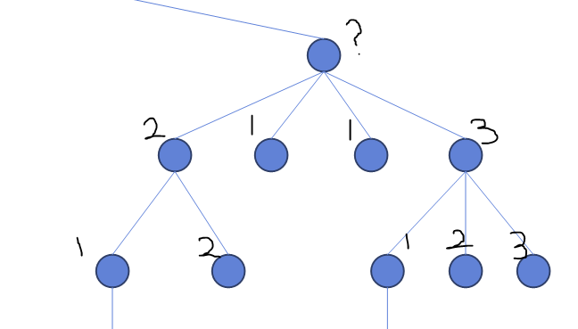
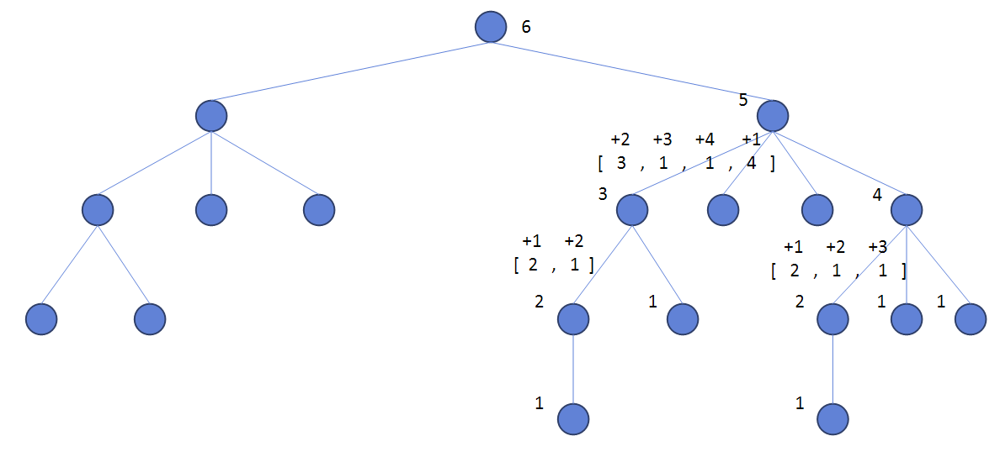

### 뉴스 전하기




##### 사용한 알고리즘

- 트리에서의 다이나믹 프로그래밍 (O(nlogn))


##### 풀이 로직



- 부하직원이 많은 사람에게 먼저 전화를 걸어야 유리하다(각각의 자식들은 병렬처리!)



- 부하직원을 얼마나 데리고 있는지에 따라 나에게 필요한 시간이 결정됨



- 부하직원이 여러 단계에 걸쳐 있을 때 자신을 루트로 하는 서브트리의 총 소요시간을 구하는 방법은?
- 부하직원들 중 가장 시간이 오래 걸리는 노드에 먼저 연락(1초 소요)
- 그 다음으로 많이 걸리는 노드에 차례대로 연락(1초씩 더 필요)



- 위와 같이 Bottom-Up 을 통해 최종 노드의 필요한 시간을 구할 수 있다.


##### Code

```python
# 재귀를 통해 bottom-up 구현
def find(cur):
    # 현재 내 부하가 없다면 내가 모든 부하직원에게 연락을 돌리는 시간은 0초
    if not narr[cur]:
        return dp[cur] # leaf node : 0초 리턴
    # 그렇지 않을 경우 자식들이 모든 연락을 돌릴 때 걸리는 시간을 담는다.
    child = []
    for nxt in narr[cur]:
        child.append(find(nxt))

    child.sort(reverse=True)
    # 가장 오래 걸리는 부하직원부터 차례대로 연락을 돌려야 하므로 내림차순으로 정렬!
    
    # 내가 부하직원한테 연락을 돌릴 때 1명당 1초씩 걸리므로 이를 차례대로 더해준다.
    for i in range(len(narr[cur])):
        child[i] += i+1
        
    # 모든 부하직원에게 연락을 돌리는데 걸리는 시간은 (부하직원들이 연락하는데 걸린시간 + 내가 해당 
    # 부하직원에게 연락하는데 걸린시간)들 중 최대값이다.
    dp[cur] = max(child)
    # 재귀를 통해 내 상사에게 자신이 모든 직원들에게 연락하는데 얼마만큼의 시간이 걸렸는지 알려주어야한다.
    return dp[cur]

# 초기화
n = int(input())
arr = list(map(int,input().split()))
narr = [[] for i in range(n)]

for i in range(n):
    if arr[i] >= 0:
        narr[arr[i]].append(i)

# idx노드의 서브트리에서 모두 연락을 받을 수 있는 시간을 담는 dp생성
dp = [0]*n
find(0)
print(dp[0])
```


##### 문제 풀이를 진행하며

- (부하직원들이 연락하는데 걸린시간 + 내가 해당 부하직원에게 연락하는데 걸린시간)을 구하는 부분에서 실수를 해서 디버깅을 몇차례 했다.
- tree dp문제를 많이 풀어보지는 않았지만 풀면서 느낀점은 dp에 담아야하는 값이 좀더 가시적(tree구조에 따르기 때문에)이여서 난이도 있는 dp문제보다는 조금 쉽게 느껴진것 같다.
- 평소에 문제를 막 푼 경향이 있는데 예시를 생각하면서 설계를 하니까 구조가 좀 더 잘 파악됐던것 같다.

