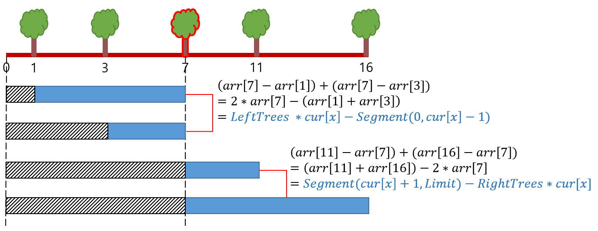
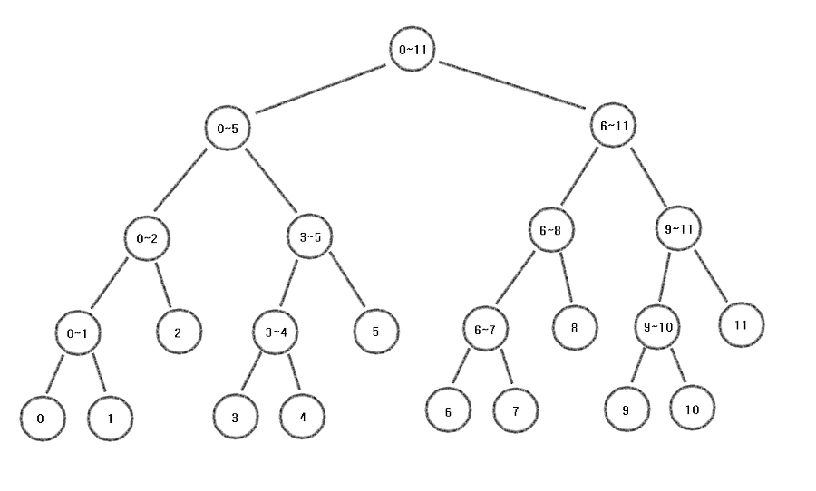

# 나무 심기


## 문제

- 1번부터 N번까지 번호가 매겨져 있는 N개의 나무가 있다.

- i번 나무는 좌표 X[i]에 심어질 것이다.

- 나무를 1번 나무부터 차례대로 좌표 X[i]에 심으려고 할때,

  각각의 나무를 심는데 드는 비용은 현재 심어져있는 모든 나무 까지 거리의 합이다.

-  1번 나무를 심는 비용은 없다.

2번 나무부터 N번 나무까지를 심는 비용의 곱을 출력하는 프로그램을 작성하시오.


## 제한 사항

- 나무의 개수 N ( 2 <= N <= 200,000)
- 각각의 좌표는 200,000보다 작은 자연수 또는 0이다


## 접근 방법

### IDEA

- 나무 심는 비용 산정

ex) 좌표 X의 1, 3, 11, 16 에 이미 나무가 심어져 있고,  좌표 X[ 7 ] 에 나무를 심으려고 할 때

COST( 7 ) = Dist( 7, 1 ) + Dist( 7, 3 ) + Dist( 7 , 11 ) + Dist( 7 , 16 ) 가 된다

> 나무를 심을 때 마다, 비용을 산정하기 위해 <br>
>
> (심어져 있는) 모든 나무들을 매번 탐색하며 계산을 하는것은 비효율적임

<br>

<u>구간 합</u>과 <u>구간 내 나무의 개수</u>를 구해두면 효율적인 풀이가 가능하다




```tex
좌표 X에 나무를 심는 비용
= (왼쪽에 있는 나무들 개수) * (현재 심을 좌표) - (왼쪽 나무들의 구간 합)
  + (오른쪽에 있는 나무들 구간 합) - (오른쪽 나무개수) * (현재 심을 좌표)
```


### 세그먼트 트리(Segment Tree, 구간 트리) 란?

- 주어진 쿼리에 대해 빠르게 응답하기 위해 만들어진 자료 구조

ex) 12개의 노드가 있고 각각의 구간 합을 저장하는 세그먼트 트리

- 세그먼트 트리 크기 설정

```java
int x = (int) Math.ceil(Math.log(N)/Math.log(2));
int size = (int) Math.pow(2, x + 1);

          혹은
              
int size = N * 4;
```


- 루트부터 리프 노드까지 내려가면서 값 업데이트

```java
public static void update(int start, int end, int node, int idx) {
    if (!(start <= idx && idx <= end)) return;

    segmentTree[node] += idx;

    if (start == end) return;

    int mid = (start + end) / 2;
    update(start, mid, node * 2, idx);
    update(mid + 1, end, node * 2 + 1, idx);
}
```




- 
- https://www.crocus.co.kr/648 참고


## 소스 코드

```java
public class 나무심기 {
    static int N;
    static int MOD = 1000000007;
    static int[] arr, cntArr;
    static long segmentTree[];

    public static void main(String[] args) throws IOException {
        BufferedReader br = new BufferedReader(new InputStreamReader(System.in));
        N = Integer.parseInt(br.readLine());

        arr = new int[N];
		// 끝 지점을 저장할 변수
        int limit = -1;
        for (int i = 0; i < N; i++) {
            arr[i] = Integer.parseInt(br.readLine());
            limit = Math.max(limit, arr[i]);
        }
        // Tree 사이즈 셋팅 (N이 최대 200,000)
        int x = (int) Math.ceil(Math.log(200000)/Math.log(2));
        int size = (int) Math.pow(2, x + 1);
        cntArr = new int[size];
        segmentTree = new long[size];

        long mul = 1;
        for (int i = 0; i < N; i++) {
            int cur = arr[i];
            update(0, limit, 1, cur);

            // (왼쪽에 있는 나무들 개수) * (현재 심을 좌표) - (현재 심을 좌표까지의 구간합)
            long left = getCNT(0, limit, 1, 0, cur - 1) * cur 
                        - getSum(0, limit, 1, 0, cur - 1);
            
            // (오른쪽에 있는 나무들 구간 합) - (오른쪽 나무개수) * (현재 심을 좌표)
            long right = getSum(0, limit, 1, cur + 1, limit)
                        - getCNT(0, limit, 1, cur + 1, limit) * cur;

            long result = (left + right) % MOD;

            // 첫번째 나무는 비용이 들지 않음
            if (i != 0) mul = (mul * result) % MOD;
        }
        System.out.println(mul);
    }

    public static void update(int start, int end, int node, int idx) {
        if (!(start <= idx && idx <= end)) return;

        cntArr[node]++;
        segmentTree[node] += idx;

        if (start == end) return;

        int mid = (start + end) / 2;
        update(start, mid, node * 2, idx);
        update(mid + 1, end, node * 2 + 1, idx);
    }

    public static long getCNT(int start, int end, int node, int left, int right) {
        if (start > right || end < left)
            return 0;

        if (left <= start && end <= right)
            return cntArr[node];

        int mid = (start + end) / 2;

        return getCNT(start, mid, node * 2, left, right)
                + getCNT(mid + 1, end, node * 2 + 1, left, right);
    }

    public static long getSum(int start, int end, int node, int left, int right) {
        if (start > right || end < left)
            return 0;

        if (left <= start && end <= right)
            return segmentTree[node];

        int mid = (start + end) / 2;

        return getSum(start, mid, node * 2, left, right)
                + getSum(mid + 1, end, node * 2 + 1, left, right);
    }
}

```

