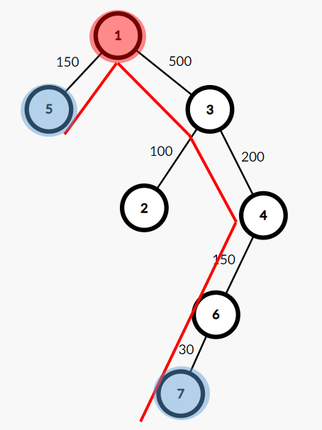

# 도로 네트워크


## 문제

- N개의 도시와 그 도시를 연결하는 N-1개의 도로로 이루어진 도로 네트워크가 있다. 

- 모든 도시의 쌍에는 그 도시를 연결하는 유일한 경로가 있고, 각 도로의 길이는 입력으로 주어진다.

총 K개의 도시 쌍이 주어진다.

이때, 두 도시를 연결하는 경로 상에서 가장 짧은 도로의 길이와 가장 긴 도로의 길이를 구하는 프로그램을 작성하시오.


## 제한사항

- 도시의 개수 N (2 ≤ N ≤ 100,000)

- 세 정수 A, B, C가 주어진다. A와 B사이에 길이가 C인 도로가 있다는 뜻이다. 

  도로의 길이는 1,000,000보다 작거나 같은 양의 정수이다.

- 다음 줄에는 K가 주어진다. (1 ≤ K ≤ 100,000)

  다음 K개 줄에는 서로 다른 두 자연수 D와 E가 주어진다. D와 E를 연결하는 경로에서 가장 짧은 도로의 길이와 가장 긴 도로의 길이를 구해서 출력하면 된다.


## 접근 방법

- 최소 공통 조상(LCA, Lowest Common Ancestor)
- DP

### IDEA




1. 주어지는 트리를 DFS 탐색하며 각 노드의 깊이를 탐색한다
   - depth[ node ] = level
   - 추가적으로 DP 구성을 위해 기본값 셋팅
     - parent [ Jump 횟수 ] [ node ] = Jump 만큼 뛰었을 때 node
     - maxDP[  Jump 횟수 ] [ node ] = Jump 만큼 뛰었을 때 최대 경로
     - minDP[  Jump 횟수 ] [ node ] = Jump 만큼 뛰었을 때 최소 경로

2. parent, maxDP, minDP DP 구성
3. 입력 D , E 를 받았을 때 LCA를 이용하여 최대 경로, 최소 경로 도출
   1. D와 E의 깊이를 맞춰준다.
      - 더 깊이 있는 노드가 낮은 깊이로 갈때 최대,최소 값을 갱신하면서 올라간다
   2. D와 E와 깊이가 같아지면, 두 노드를 모두 점프 시켜보면서 최소 공통 조상을 찾는다
      - 최소 공통 조상을 찾으면서 최대, 최소 값을 갱신한다.

```java
public class 도로네트워크 {
    private static ArrayList<Node>[] tree;
    private static int[] depth;
    private static final int MAX_N = 100000;
    private static final int MAX_D = 17;
    private static int[][] parent;
    private static int[][] maxDP, minDP;

    public static void main(String[] args) throws IOException {
        BufferedReader br = new BufferedReader(new InputStreamReader(System.in));
        StringTokenizer st = null;
        parent = new int[MAX_D + 1][MAX_N + 1];
        maxDP = new int[MAX_D + 1][MAX_N + 1];
        minDP = new int[MAX_D + 1][MAX_N + 1];

        int N = Integer.parseInt(br.readLine().trim());
        tree = new ArrayList[N + 1];
        depth = new int[N + 1];

        for (int i = 1; i <= N; i++) tree[i] = new ArrayList<>();

        for (int i = 1; i < N; i++) {
            st = new StringTokenizer(br.readLine().trim());

            int u = Integer.parseInt(st.nextToken());
            int v = Integer.parseInt(st.nextToken());
            int dist = Integer.parseInt(st.nextToken());

            tree[u].add(new Node(v, dist));
            tree[v].add(new Node(u, dist));
        }

        Arrays.fill(depth, -1);
        dfs(1, 0);

        for (int jump = 1; jump < MAX_D; jump++) {
            for (int i = 1; i <= N; i++) {
                parent[jump][i] = parent[jump - 1][parent[jump - 1][i]];
                minDP[jump][i] = Math.min(minDP[jump - 1][i], minDP[jump - 1][parent[jump - 1][i]]);
                maxDP[jump][i] = Math.max(maxDP[jump - 1][i], maxDP[jump - 1][parent[jump - 1][i]]);
            }
        }

        int M = Integer.parseInt(br.readLine().trim());
        StringBuilder sb = new StringBuilder();
        for (int i = 1; i <= M; i++) {
            st = new StringTokenizer(br.readLine().trim());

            int u = Integer.parseInt(st.nextToken());
            int v = Integer.parseInt(st.nextToken());

            int[] result = lca(u, v);
            sb.append(result[0]).append(" ").append(result[1]).append("\n");
        }
        System.out.println(sb.toString());
    }

    private static void dfs(int node, int level) {
        if (depth[node] != -1)
            return;

        depth[node] = level;
        for (Node next : tree[node]) {
            if (depth[next.no] != -1) continue;

            parent[0][next.no] = node;
            maxDP[0][next.no] = minDP[0][next.no] = next.dist;

            for (int i = 1; i <= MAX_D; i++) {
                if (parent[i - 1][next.no] == 0) break;

                parent[i][next.no] = parent[i - 1][parent[i - 1][next.no]];
            }
            dfs(next.no, level + 1);
        }
    }

    private static int[] lca(int u, int v) {
        // 항상 v가 더 깊은 노드로
        if (depth[u] > depth[v]) return lca(v, u);

        int[] result = {Integer.MAX_VALUE, Integer.MIN_VALUE};

        // v의 깊이를 u의 깊이와 같게 Jump 하면서 맞춰준다
        for (int i = MAX_D; i >= 0; i--) {
            if (depth[v] - depth[u] >= (1 << i)) {  
                // v가 u와 같은 높이로 올라갈 때도 max와 min 값 비교
                result[0] = Math.min(result[0], minDP[i][v]);
                result[1] = Math.max(result[1], maxDP[i][v]);

                v = parent[i][v];
            }
        }
        
		// u와 v가 같은 노드라면
        if (u == v) return result;

        // 깊이가 같은 u, v 에서 LCA에 가깝게 점프
        for (int i = MAX_D; i >= 0; i--) {
            // 부모가 다르다는건 u,v와 LCA에 다른 노드가 있다는 것
            //        LCA
            //      x      y
            //     u         v
            if (parent[i][u] != parent[i][v]) {
                // 최대 최소를 확인하고
                result[0] = Math.min(result[0], Math.min(minDP[i][u], minDP[i][v]));
                result[1] = Math.max(result[1], Math.max(maxDP[i][u], maxDP[i][v]));
                
                // 각 노드들을 점프 해준다
                u = parent[i][u];
                v = parent[i][v];
            }
        }
        result[0] = Math.min(result[0], Math.min(minDP[0][u], minDP[0][v]));
        result[1] = Math.max(result[1], Math.max(maxDP[0][u], maxDP[0][v]));
        return result;
    }

    static class Node {
        int no;
        int dist;

        Node(int no, int dist) {
            this.no = no;
            this.dist = dist;
        }
    }
}

```

