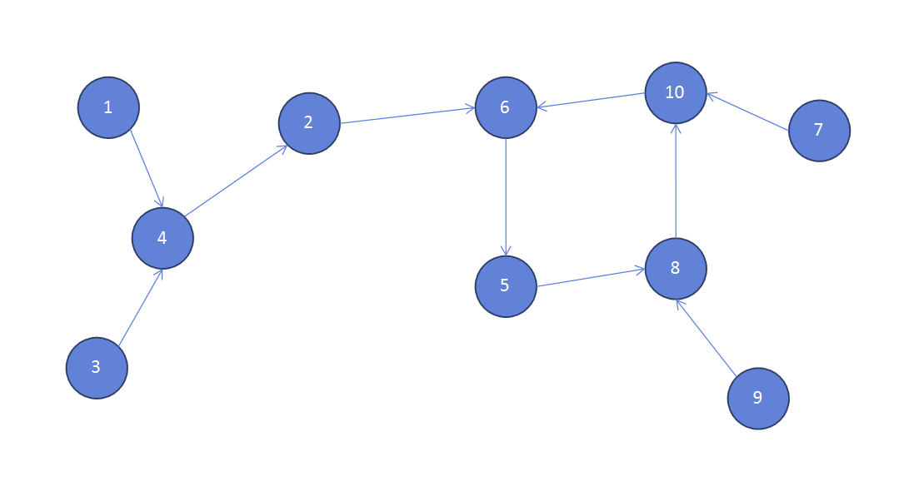
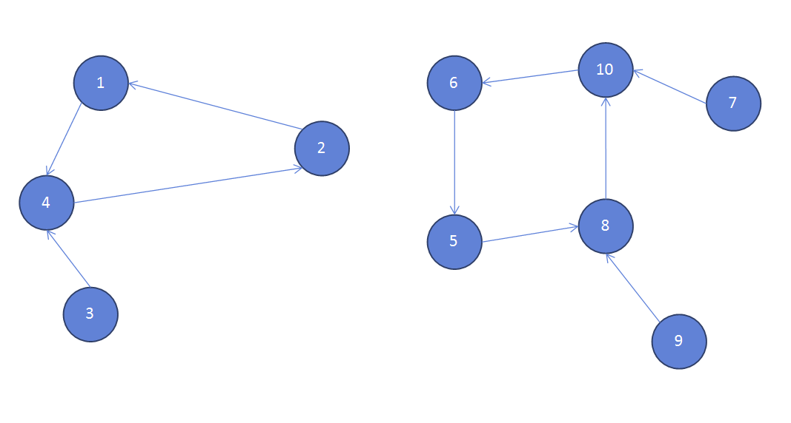

### 마피아 게임


##### 사용한 알고리즘

- Depth First Search(O(n))


##### 풀이 로직

- 마피아는 마피아를 지목하지 못한다. 때문에 시민에게만 지목 받은 사람은 마피아라고 생각할 수 있다.

  

- 문제에서 구하는 값은 마피아가 될 수 있는 사람의 최대값이기 때문에 마피아가 될 수 있는 사람들을 마피아로 지정하고 시작한다.

- 부모들을 타면서 들어갔을 때 부모가 없는 노드는 마피아가 될 수 있다. (ex 백준 1번 예시)

  

- 단절된 그룹이 여러개 일 수 있다.

- 위상정렬 처럼 leaf 노드가 없는 경우도 있다. (ex 백준 2번 예시)

- 때문에 모든 노드를 다 돌면서 dfs를 이용해 leaf 노드를 찾아주고 해당 지점을 기준으로 마피아를 늘려나간다!


##### Code

```python
import sys
from collections import deque
input = sys.stdin.readline

def dfs(x):
    # 이미 방문한 노드면 더 볼 필요가 없다. (이전에 함수를 진행하면서 값이 정해진다.)
    if vis[x]:
        return
    # 들어오면 무조건 먼저 방문체크
    vis[x] = 1
    
    # 부모가 없다는건 leaf 노드라는 이야기가 되고 이는 마피아가 될 조건을 충족한다.
    if not parr[x]:
        mafia[x] = 1
        return
    # 부모가 있다면 부모노드로 들어가 그 위에 부모노드가 있는지 확인한다.
    for pre in parr[x]:
        # 재귀를 통해 끝까지 올라가서 확인하고 싸이클일 경우 visited에 걸려서 재귀를 끝내게된다.
        dfs(pre)
        # 나를 지목한 사람이 마피아라면 나는 마피아가 아니다.
        if mafia[pre] == 1:
            mafia[x] = 0
    
    # 내가 지목한 사람이 마피아일 경우 나는 마피아가 아니다.
    nxt = narr[x]
    if mafia[nxt] == 1:
        mafia[x] = 0
    
    # 위에서 나를 지목한 사람이 모두 마피아가 아니고 내가 지목한 사람 또한 마피아가 아니여야
    # mafia[x] == -1 을 갖고 있을 수 있다. 그리고 이는 마피아가 될 수 있는 조건에 충족한다.
    # 이부분에서 단순 싸이클일때의 문제가 해결된다.
    if mafia[x] == -1:
        mafia[x] = 1
        # 내가 마피아면 날 지목한 사람, 내가 지목한 사람은 마피아가 아니게된다.
        mafia[narr[x]] = 0
        for pre in parr[x]:
            mafia[pre] = 0

    # 모든 노드를 다 확인해야 된다는걸 몰랐을 때(노드들 사이에 단절) 다음노드로 넘겨주면 모든 노드를 탐색할 수 있다고 생각해서 넣어줬다.
    # 이부분을 빼니까 실행시간이 아주 조금 줄었다.
    dfs(nxt)


n = int(input())
# 자신이 지목하는 노드를 담는 배열
narr = [0]*(n+1)
# 자신을 지목한 노드들을 담는 배열
parr = [[] for _ in range(n+1)]
for i in range(1,n+1):
    narr[i] = int(input())
    parr[narr[i]].append(i)
    
# dfs를 돌때 방문 처리를 해주기 위해 visited 사용
vis = [0]*(n+1)
# 마피아인지 판단이 안된 노드를 -1, 마피아가 될 수 있는 노드를 1, 마피아가 될 수 없는 노드를 0으로 둔다.
mafia = [-1]*(n+1)
ans = 0

# 단순 싸이클일 경우나 노드들 간의 단절이 생길 경우 모든 노드를 다 확인해야한다.
for i in range(1,n+1):
    dfs(i)

# print(mafia)
print(mafia.count(1))
```


##### 문제 풀이를 진행하며

- 처음에 SCC문제라는 이야기를 들어서 많이 헤맸다. 
- 위상 정렬로 풀이하려고 했으나 단순 싸이클에서 생기는 문제를 해결하지 못했다. (다른 분의 코드를 보니 위상 정렬로 해결할 수 있는 부분을 다 해결하고 방문처리가 안된 사람 기준으로 돌려주면 해결이 가능했다.)
- 처음에 문제를 접근 할 때 문제가 뭘 요구하는지 파악하는데 오래걸렸다.

