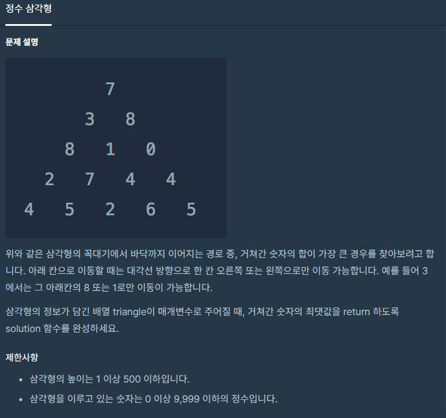
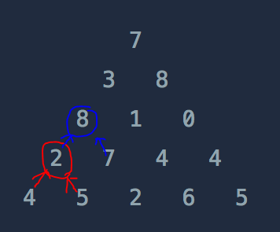

### 정수 삼각형



##### 사용한 알고리즘

- Depth First Search (O(n))
- Dynamic Programming


##### 풀이 로직

- 한쪽을 선택하면서 Top Bottom으로 진행하면 같은 노드를 여러번 탐색해야한다.
- 때문에 밑에서부터 올라오면서 가장 큰값을 갱신해주면 각 노드를 한번씩 탐색하고 최대값을 찾을 수 있다.

- DFS를 진행하며 가장 밑까지 진행한다.



- Bottom Up으로 진행하면서 둘중에 가장 큰 값을 더해주면서 위까지 진행한다.


##### Code

```python
def dfs(arr,x,y,n,vis):
    # 왔던 노드라면 밑의 값들을 모두 포함하고 있기 때문에 바로 노드값을 리턴
    if vis[x][y]:
        return arr[x][y]
    vis[x][y] = 1
    # 가장 밑에 값은 더해줄 값이 없기때문에 바로 리턴!
    if x == n-1:
        return arr[x][y]
    # 가장 밑까지 진행
    # 배열에 밑에있는 값들 중 큰값을 더해주면서 갱신
    arr[x][y] += max(dfs(arr,x+1,y,n,vis), dfs(arr,x+1,y+1,n,vis))
    # 재귀의 값을 계산해야되기 때문에 현재 노드의 계산이 끝나면 값을 리턴해준다.
    return arr[x][y]

def solution(triangle):
    n = len(triangle)
    vis = [[0]*i for i in range(1,n+1)]
    return dfs(triangle,0,0,n,vis)
```

